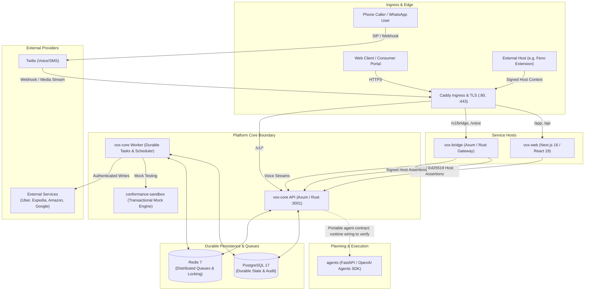
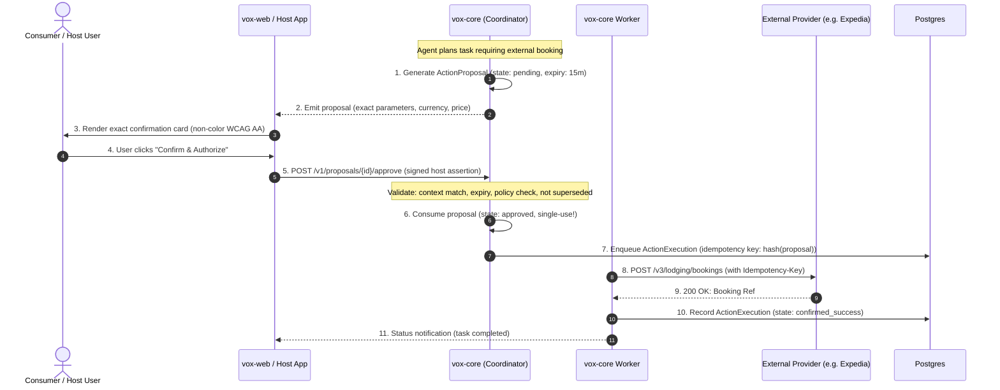

# Vox Platform V1 — Architecture Breakdown & Implementation Reference

**Status:** Implementation map under release verification; not a release attestation
**Governing Baseline:** [`docs/PRD.md`](./PRD.md), [`docs/execution-order.md`](./execution-order.md), [`docs/conceptual-model.md`](./conceptual-model.md)
**Release Version:** Platform V1 candidate (E52 is reopened pending live release evidence)
**Date:** 2026-09-24

---

## 1. Executive Architecture Summary

Vox is a modular, self-hostable AI platform designed to execute everyday tasks through external service integrations without sacrificing security, privacy, or user agency.

The architecture strictly decouples **six core concepts** to prevent them from ever collapsing into one another:
```
┌────────────────────────────────────────────────────────────────────────────────────────┐
│                                 SIX DECOUPLED CONCERNS                                 │
├──────────────────────────┬─────────────────────────────────────────────────────────────┤
│ 1. User Identity         │ Person within deployment & host-app context (FR-IDN)        │
│ 2. Agent                 │ Interprets intent and plans tasks; zero action rights (FR-AGT)│
│ 3. Integration           │ Declares capabilities, schemas, and provider boundaries (FR-INT)│
│ 4. Connection            │ Links a user to a specific external authenticated account (FR-CON)│
│ 5. Capability Grant      │ Permitted pairing of (User, Agent, Connection, Capability) (FR-GRT)│
│ 6. Action Approval       │ Single-use, non-replayable authorization for exact action (FR-ACT)│
└──────────────────────────┴─────────────────────────────────────────────────────────────┘
```

The system is deployed as an open self-hosted reference stack consisting of 5 repositories plus independent reference hosts, operating strictly through authenticated public platform boundaries.

> **Verification note (2026-09-24):** The previous version treated unit and simulated checks as public-release proof. The independent `feno-extension` repository is absent, its local acceptance script printed success without exercising a host, and the terminal deployment test simulated upgrade and restore. Those scripts now fail closed or require live evidence. The release dossier is checked by `vox-deploy/scripts/verify-platform-v1-release.sh`. Docker is unavailable in this workspace, so no clean-install or recovery rehearsal has been performed here. Fresh PostgreSQL tests prompted candidate fixes for connection disconnect, status persistence, privacy/export, audit events, execution policy, and duplicate scheduled/summary work. Webhook delivery and production secret custody remain incomplete. Unmeasured performance and provider claims below remain design intent.

---

## 2. High-Level System Architecture & Topology

The Platform V1 architecture connects user interfaces, telephony/messaging channels, autonomous planning agents, and external service providers through the central platform coordinator (`vox-core`).



### Repository Roles & Technologies

| Repository | Tech Stack | Role & Core Responsibilities | Public Boundary Contracts |
| :--- | :--- | :--- | :--- |
| [**`vox-core`**](https://github.com/vox-suite/vox-core) | Rust 1.85+, Axum 0.8, SQLx, Tokio, PostgreSQL 17, Redis 7 | Central platform authority: durable tasks, user context, connection custody, capability grants, proposal generation, exact approvals, policy enforcement, audit trails, and privacy/retention engines. | `/v1/durable-tasks`, `/v1/proposals`, `/v1/connections`, `/v1/grants`, `/v1/privacy`, `/v1/reminders` |
| [**`vox-web`**](https://github.com/vox-suite/vox-web) | Next.js 16 (App Router), React 19, Better-Auth, Tailwind CSS, TypeScript | Consumer-facing portal & reference host: standalone authentication (OAuth + email OTP), connections manager, grant inspector, proposal approval UI, reminders UI, privacy controls, and accessible status presentation. | Communicates exclusively with Core via signed Ed25519 host context assertions; zero direct database or private crate access. |
| [**`vox-bridge`**](https://github.com/vox-suite/vox-bridge) | Rust 1.85+, Axum, Tokio, DashMap, WebSockets | Ingress gateway for telephony (Twilio Voice) and messaging (WhatsApp/SMS): bi-directional audio streaming, phone-number-to-context resolution, delivery receipts, and truthful channel notifications. | Signed conversation ingress, `/v1/voice/inbound`, `/v1/messaging/inbound`, webhook signature verification. |
| [**`agents`**](https://github.com/vox-suite/agents) | Python, FastAPI, OpenAI Agents SDK, Pydantic | Portable Core-backed agent package; legacy standalone `/chat` is disabled by default. The active Bridge voice path currently streams through Core's Rust conversation agent. | Calls documented Core public routes through a host-owned client; runtime deployment integration still needs end-to-end proof. |
| [**`vox-deploy`**](https://github.com/vox-suite/vox-deploy) | Docker Compose, Caddy, Bash, Python | Self-hosted reference stack orchestration: production & self-hosted Compose recipes, automated backup/restore, legal decision records, license scanning, and release verification gates. | Clean install, upgrade, automated rollback preserving durable state, disaster recovery scripts. |

---

## 3. Platform Invariants & Core Design Rules

The platform enforces six non-negotiable architectural invariants:

### Invariant 1: Non-Action Authority in Reminders & Notifications
- **PRD Ref:** FR-REM-009, FR-CHN-004
- **Rule:** Reminders, push notifications, and background schedule firings are strictly prohibited from possessing or injecting action execution authority (`action_id`, `proposal_id`, `execute_consequential`).
- **Enforcement:** Core schema constraints and input validation reject any reminder payload that includes action identifiers or bypasses human proposal approval.

### Invariant 2: Truthful Channel Delivery
- **PRD Ref:** FR-CHN-003, FR-CHN-005
- **Rule:** When an outbound notification is sent via carrier or message service, the state `delivered_to_channel` strictly indicates transport handoff (e.g., carrier network receipt). It is never displayed, worded, or reported as "human-seen" or "confirmed read".
- **Enforcement:** `getAccessibleStatusIndicator("delivered_to_channel")` displays `"DELIVERED TO CHANNEL (NOT CONFIRMED SEEN)"` with ARIA disclosure `aria-label="Delivered to carrier channel; not confirmed seen by human"`.

### Invariant 3: Sensitive Preference Confirmation
- **PRD Ref:** FR-PRF-003, FR-PRF-004
- **Rule:** Saving or replacing sensitive personal preferences (e.g., home address, medical dietary rules, default payment tier) requires explicit user confirmation. Preferences confer zero authority to initiate external transactions; they are advisory only.
- **Enforcement:** `PrivacyControls` component checks `SENSITIVE_PREFERENCE_KEYS` and requires a secondary explicit confirmation step.

### Invariant 4: Transparent Deletion Disclosures
- **PRD Ref:** FR-DAT-006, FR-DAT-007
- **Rule:** Deleting platform task history purges database records from active tables, but explicitly discloses external limitations: external carrier logs (Twilio), external provider itineraries (Amazon/Expedia/Uber), legal hold records (up to 365 days), and disaster recovery backup windows (up to 30 days) are beyond immediate deletion. Local deletion never cancels completed external transactions.
- **Enforcement:** Canonical disclosure copy returned on every `POST /v1/privacy/delete-history` call.

### Invariant 5: Credential-Free Portable Exports
- **PRD Ref:** FR-PRT-005, FR-PRT-006
- **Rule:** Data exports exclude raw credentials, secrets, active action proposals, and consumable approvals. Imported connections are forced to `pending_reauthorization` on the target deployment.
- **Enforcement:** Automated canary scan in `src/privacy/mod.rs` strips credentials before export; import router sets connection state to `Pending`.

### Invariant 6: Fail Closed on Uncertainty
- **PRD Ref:** NFR-SEC-001
- **Rule:** When authentication, connection authorization, capability grants, spending limits, or provider status cannot be conclusively proven, execution is denied.

---

## 4. Deep-Dive: Implementation of PRD Functional Modules

### 4.1 Identity, Context & Host Trust (FR-IDN, FR-HST)
- **PRD Sections:** 11.1, 11.2
- **Source Files:** [`vox-core/src/identity/`](https://github.com/vox-suite/vox-core/tree/main/src/identity), [`vox-core/src/http/host_trust.rs`](https://github.com/vox-suite/vox-core/blob/main/src/http/host_trust.rs), [`vox-web/src/lib/consumer-auth/`](https://github.com/vox-suite/vox-web/tree/main/src/lib/consumer-auth)
- **Database Schema:** `user_contexts`, `host_applications`, `host_credentials`, `identity_adapters`

```
  ┌────────────────────────────────────────────────────────────────┐
  │ Host App (vox-web)                                             │
  │   - Better-Auth Session                                        │
  │   - Ed25519 Key Pair                                           │
  └────────────────┬───────────────────────────────────────────────┘
                   │ Header: X-Vox-Host-Assertion: Ed25519 Signed JWT
                   │ Claims: { deployment_id, host_app_id, host_user_id, nonce, exp }
                   ▼
  ┌────────────────────────────────────────────────────────────────┐
  │ Core API (src/identity/context.rs)                             │
  │   1. Validates host credential & Ed25519 signature              │
  │   2. Checks replay cache (nonce + timestamp <= 300s)           │
  │   3. Resolves/Provisions canonical `ResolvedUserContext`:       │
  │      - user_context_id: UUIDv4                                 │
  │      - host_app_id: UUIDv4                                     │
  │      - host_user_id: String                                    │
  │      - organization_id: Option<UUIDv4>                         │
  └────────────────────────────────────────────────────────────────┘
```
- **Key Mechanics:**
  - Context isolation: Database queries filter strictly by `user_context_id`. No cross-context querying is possible.
  - Zero password storage in Core: Authentication is delegated to host apps; Core authenticates the host via signed assertions.

---

### 4.2 Integrations, Connections & Grants (FR-INT, FR-CON, FR-GRT)
- **PRD Sections:** 11.4, 11.5, 11.6
- **Source Files:** [`vox-core/src/integrations/`](https://github.com/vox-suite/vox-core/tree/main/src/integrations), [`vox-core/src/connections/`](https://github.com/vox-suite/vox-core/tree/main/src/connections), [`vox-core/src/grants/`](https://github.com/vox-suite/vox-core/tree/main/src/grants)
- **Database Schema:** `integrations`, `integration_capabilities`, `connections`, `capability_grants`

```
       User Context
            │
            ├─────────────────────────────────────────┐
            ▼                                         ▼
  ┌───────────────────┐                     ┌───────────────────┐
  │   Agent Config    │                     │    Connection     │
  │   (e.g. Travel)   │                     │  (e.g. Uber OAuth)│
  └─────────┬─────────┘                     └─────────┬─────────┘
            │                                         │
            └────────────────────┬────────────────────┘
                                 ▼
                     ┌───────────────────────┐
                     │   Capability Grant    │
                     │  (travel_agent, uber, │
                     │   read_trip_history)  │
                     └───────────────────────┘
```
- **Key Mechanics:**
  - **Connection Custody:** Provider tokens (OAuth refresh/access tokens) are encrypted at rest with AES-256-GCM. Tokens are never exposed to agents or host browsers.
  - **Provider-Verified Callbacks:** Core exposes `/v1/connections/callback`; provider custody and live account identity must be verified per enabled integration.
  - **Granular Grants:** Grants bind an agent to a specific capability on a specific connection. Revoking a connection automatically cascades and disables all associated grants without destroying audit history.

---

### 4.3 Action Proposals, Approvals & Execution (FR-ACT, FR-WRT)
- **PRD Sections:** 11.7, 11.16
- **Source Files:** [`vox-core/src/proposals/`](https://github.com/vox-suite/vox-core/tree/main/src/proposals), [`vox-core/src/execution/`](https://github.com/vox-suite/vox-core/tree/main/src/execution), [`vox-core/src/http/proposals.rs`](https://github.com/vox-suite/vox-core/blob/main/src/http/proposals.rs)
- **Database Schema:** `action_proposals`, `action_executions`, `execution_attempts`



- **Key Mechanics:**
  - **Exact Match Invariant:** Any change in price, date, or parameters supersedes the proposal (`state: superseded`). The user cannot approve outdated details.
  - **Single-Use Consumption:** Once an approval is processed, its authority is consumed immediately. Replay attempts are rejected.
  - **Unknown-Outcome Pause:** If an external call times out after dispatch, the execution is marked `unknown_outcome`. The system pauses work and requires human or reconciliation review before re-attempting.

---

### 4.4 Durable Tasks, Runs & Reconnect (FR-TSK, NFR-REL)
- **PRD Sections:** 11.8, 12.2
- **Source Files:** [`vox-core/src/tasks/`](https://github.com/vox-suite/vox-core/tree/main/src/tasks), [`vox-core/src/worker/`](https://github.com/vox-suite/vox-core/tree/main/src/worker)
- **Database Schema:** `tasks`, `task_runs`, `task_steps`
- **Key Mechanics:**
  - **State Machine:** `queued` → `running` → `waiting(approval | input | rate_limit)` → `completed | failed | cancelled`.
  - **Disconnect Resilience:** Tasks run independently of the host client's WebSocket or HTTP session. A user can close their browser, disconnect from mobile, and later reconnect.
  - **Authoritative Reconnect:** Reconnecting queries `/v1/durable-tasks/{id}` to reconstruct state directly from PostgreSQL, prohibiting optimistic local invention.

---

### 4.5 Timezone-Faithful Reminders & Channel Ingress (FR-REM, FR-CHN)
- **PRD Sections:** 11.11, 11.12
- **Source Files:** [`vox-core/src/reminders/`](https://github.com/vox-suite/vox-core/tree/main/src/reminders), [`vox-bridge/src/channels/`](https://github.com/vox-suite/vox-bridge/tree/main/src/channels)
- **Database Schema:** `reminders`, `reminder_deliveries`
- **Key Mechanics:**
  - **Timezone Intent Preservation:** Reminders store both wall-clock time (`09:00:00`) and the IANA timezone (`America/New_York` or `Asia/Kolkata`). This ensures DST changes do not silently shift delivery times.
  - **Delivery Status Tracking:** Deliveries record provider message SIDs, attempt counts, and delivery timestamps.

---

### 4.6 Privacy, Retention & Portable Export (FR-PRF, FR-DAT, FR-PRT)
- **PRD Sections:** 11.18, 11.19, 11.20
- **Source Files:** [`vox-core/src/privacy/`](https://github.com/vox-suite/vox-core/tree/main/src/privacy), [`vox-web/src/components/consumer/privacy-controls.tsx`](https://github.com/vox-suite/vox-web/blob/main/src/components/consumer/privacy-controls.tsx)
- **Database Schema:** `user_preferences`, `retention_policies`, `portable_exports`
- **Key Mechanics:**
  - **Declared Retention Policy:** Task history default retention (90 days), temporary context (24 hours), audit hold (365 days), and backup window (30 days).
  - **Task History Deletion:** `POST /v1/privacy/delete-history` purges conversation turns and tasks from the database while retaining mandatory audit event records for legal compliance.
  - **Historical Action Permanence:** Even if an extension is uninstalled or an integration deleted, historical action execution evidence (proposals, amounts, provider confirmations) remains queryable for auditing and accounting.

---

### 4.7 Open Self-Hosting & Distribution Readiness (FR-OSS, FR-PRT)
- **PRD Section:** 11.21
- **Source Files:** [`vox-deploy/compose.self-hosted.yml`](../compose.self-hosted.yml), [`vox-deploy/deployments/manifest.json`](../deployments/manifest.json), [`vox-deploy/LICENSE`](../LICENSE), [`vox-deploy/docs/legal-and-distribution-decision.md`](legal-and-distribution-decision.md)
- **Key Mechanics:**
  - **Full Open-Source Reference Stack:** The Compose definition exists; a clean install on pinned images remains a release gate.
  - **Reproducible Revision Pinning:** The source candidate manifest records external repository commits. The final `vox-deploy` commit and image digests belong in an external release attestation after builds.
  - **Credential Isolation:** Scanning and review of actual built artifacts remain release evidence requirements.

---

## 5. End-to-End Execution Lifecycles

### Complete Booking & Approval Flow
```
User Prompt: "Book Hyatt hotel in Seattle for tomorrow under $250"
   │
   ▼
[vox-web / bridge] ──(Signed Host Assertion)──> [vox-core]
                                                    │
                                                    ▼
                                            [ResolvedUserContext]
                                                    │
                                                    ▼
                                            [agents (Planner)]
                                                    │
                                                    ▼
                                            Core checks Grant:
                                            (travel_agent, expedia_conn, book_lodging)
                                                    │
                                                    ▼
                                            Expedia Search: $219.00 USD (Authoritative)
                                                    │
                                                    ▼
                                            [ActionProposal Created]
                                            - Price: 219.00 USD
                                            - Hotel: Hyatt Seattle
                                            - Expiry: +15 minutes
                                                    │
                                                    ▼
                                            [User Reviews & Confirms]
                                                    │
                                                    ▼
                                            Core: Single-Use Consumption
                                            Postgres: Idempotent Execution Attempt
                                                    │
                                                    ▼
                                            Provider Write API Dispatched
                                                    │
                                                    ▼
                                            Confirmed Success (Ref #HT-98712)
                                                    │
                                                    ▼
                                            Audit Event Recorded & User Notified
```

---

## 6. Non-Functional Requirements (NFR) Verification

| NFR Category | Requirement | Implementation & Architectural Evidence |
| :--- | :--- | :--- |
| **Security** | `NFR-SEC-001` Fail-Closed | All routers enforce authorization layers before domain execution. Unauthenticated calls return `401 Unauthorized` / `403 Forbidden`. |
| **Security** | `NFR-SEC-002` Secret Isolation | AES-256-GCM encryption for stored tokens. Environment variables for master secrets. Zero credentials in client-facing bundles or logs. |
| **Security** | `NFR-SEC-004` Host Assertion Integrity | Ed25519 asymmetric signature verification with nonce replay cache and 5-minute expiry windows. |
| **Reliability**| `NFR-REL-001` Durable State Survival | PostgreSQL 17 ACID persistence with strict foreign keys. Worker process can restart mid-task and resume safely. |
| **Reliability**| `NFR-REL-004` Rollback State Preservation | Rollback automation restores binary images without touching or rolling back PostgreSQL database tables. |
| **Accessibility**| `WCAG 2.2 AA` Non-Color Reliance | All badges pair color with text markers (`"✓ APPROVED"`, `"⏳ PENDING"`, `"⚠️ EXPIRED"`) and distinct ARIA labels. |
| **Localization**| Locale & Value Integrity | `formatAuthoritativeCurrency` and `formatAuthoritativeDistance` preserve provider values without silent currency conversion or regional shifting. |

---

## 7. Verification Status

The local suites exercise useful conformance behavior, but passing them does not prove every PRD clause or release gate. `vox-deploy/docs/v1-traceability.json` enumerates every P0, NFR, acceptance scenario, and release gate as **unverified** until a named assertion and real-run log are attached. `vox-deploy/scripts/verify-v1-evidence.py` rejects missing requirement records, missing image digests, dirty or mismatched commits, and missing or altered logs. Provider, legal, and usability claims still require accountable review of the recorded evidence.
