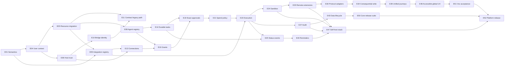

# Vox Platform V1 execution order

Status: canonical implementation playbook
Source of truth for product scope: [`docs/PRD.md`](./PRD.md)
Source of truth for work state: the linked GitHub issues
Validated tracker snapshot: 2026-09-19
Terminal release issue: `E52`

> **2026-09-23 verification note:** E12 merged through
> [`vox-web#13`](https://github.com/vox-suite/vox-web/pull/13). E13
> ([`vox-core#10`](https://github.com/vox-suite/vox-core/issues/10)) was
> reopened after the public connection contract proved incomplete; E17 must
> wait for its accepted replacement. The referenced `feno-extension` repository
> currently returns GitHub 404, so E44/E46 and their downstream release edges
> require tracker and repository repair. See
> [`platform-v1-state-2026-09-23.md`](./platform-v1-state-2026-09-23.md).
>
> **2026-09-23 E15 handoff correction:** E09
> ([`vox-core#9`](https://github.com/vox-suite/vox-core/issues/9)) was reopened:
> its only discovery route requires the deployment service token and is not
> scoped to an authenticated user context. E15 and E13 remain blocked on the
> accepted G2 discovery contract. The `agents` work can be prototyped, but it
> must not enter the release path until E09 is accepted.

This document turns the accepted Platform V1 PRD and the six-repository GitHub issue graph into an executable delivery order. It does not replace issue acceptance criteria. If this document and an issue disagree about implementation state, stop, correct the issue graph, and then update this document in the same change.

## 1. Operating model

### 1.1 Repository responsibilities

| Repository | Platform V1 responsibility | Boundary that must remain replaceable |
|---|---|---|
| `vox-core` | Reusable runtime, domain semantics, identity and authority enforcement, durable work, integration mediation, audit, lifecycle, and conformance | Hosts, agents, model providers, integration protocols, service providers, and observability sinks |
| `vox-web` | First-party Vox host application | It consumes the same public Core contract available to external hosts |
| `vox-bridge` | Voice and messaging channel adapter | It owns transport and channel presentation, never platform authority |
| `vox-deploy` | Deployment composition, operator runbooks, revision manifests, upgrades, rollback, and terminal release evidence | Deployment topology and infrastructure providers |
| `agents` | Portable reference-agent definition and Core client | Model provider and host application |
| `feno-extension` | Independent reference host implemented as a browser extension | Vox Web implementation details and proprietary Vox services |

### 1.2 Four-lane delivery rule

At most four tickets may be in implementation at once across all repositories. Review, CI, and release-evidence collection for a completed implementation do not consume a lane after the owner has handed the ticket to its integration owner. A ticket still consumes its lane when it is awaiting fixes, contract acceptance, or missing evidence.

Use this frontier algorithm whenever a lane becomes free:

1. Refresh the six repositories and determine the open Platform V1 tickets.
2. A ticket is **ready** only when every URL under its `Blocked by` section is closed and the accepted upstream artifact or contract is available.
3. Choose ready work from the earliest unfinished wave and sub-frontier.
4. Within that frontier, prefer the critical path, then contract producers, then required consumers, then provider-conditional work.
5. Assign exactly one implementation owner. If the ticket crosses a repository boundary, also name one integration owner in the issue.
6. Before implementation begins, record the upstream revisions and accepted contract versions being consumed.
7. Close a ticket only after its repository is green and all required evidence is attached to the issue.
8. Recompute the frontier after every closure, reopened contract, or provider-feasibility decision.

Four lanes are a ceiling, not a utilization target. Never start downstream work merely to keep a lane busy. Draft contracts are unsuitable for downstream implementation; consumers may prototype against them, but such prototypes cannot merge into the release path until the gate is accepted.

### 1.3 Definition of done for every ticket

A ticket is complete only when all of the following are true:

- The issue acceptance criteria are satisfied without weakening the PRD semantics.
- Automated tests covering the changed public behavior pass in the owning repository.
- The repository's standard lint, type, format, build, migration, and security checks pass where applicable.
- Required manual scenarios have been performed against an accepted upstream revision.
- Evidence is attached to the issue: command and result, immutable revision, test environment, relevant recordings or screenshots, migrations, and known limitations.
- Public contract or operator documentation is updated in the owning repository.
- Failure, downgrade, and rollback behavior is tested or explicitly rehearsed.
- Every downstream consumer has an integration owner who acknowledges the accepted artifact.

### 1.4 Change and recovery rules

- **Add, migrate, contract:** after a contract freeze, make additive changes first, migrate all consumers second, and remove or tighten old behavior last.
- **Producer versus consumer failure:** reopen the producing ticket when the accepted public behavior is wrong or incomplete; reopen the consumer ticket when its mapping, presentation, or integration is wrong.
- **Fail closed:** uncertainty about identity, authority, policy, approval, provider state, or conformance prevents consequential execution.
- **Preserve evidence:** rollback may disable new entry points, but must not erase durable tasks, attempts, outcomes, approvals, audit records, or migration provenance.
- **No provider exception:** a provider adapter may report weaker capabilities or hand off, but cannot bypass grants, policy, approval, context minimization, or outcome truthfulness.
- **Revision pinning:** every cross-repository test and deployment records exact commit SHAs and schema or protocol versions.
- **Contract reopening:** a gate reopens when a conformance test exposes semantic ambiguity, a security review finds an authority bypass, a required consumer cannot implement the public boundary without internals, or production evidence invalidates a declared guarantee.

## 2. Contract gates

### 2.1 Gate G1 — Identity

**Producers:** `E04`, `E05`, `E06`, `E07`, `E10`, `E11`.
**Consumers:** Vox Web, Feno, Bridge, Agents, and every later Core authority resource.
**Accepted contract:** canonical user context; deployment, host, organization, and host-user isolation; authenticated host trust; replaceable identity adapters; proof-based linking; compatibility migration away from channel-only identity.

Required evidence:

- Isolation tests cover cross-deployment, cross-host, cross-organization, and cross-user denial.
- Host assertions and recovery flows resist replay and arbitrary identity claims.
- Existing conversations, schedules, tasks, and actions retain correct ownership after migration.
- Bridge ingress resolves the same user-context semantics as first-party and external hosts.
- Compatibility tests pass before the legacy path is contracted.

Compatibility expectation: identifiers may gain fields and versioning, but accepted context meaning cannot be reinterpreted. Existing records remain addressable during migration. Reopen G1 for identity confusion, unsafe implicit linking, replay, missing tenant isolation, or a host that needs privileged internals.

### 2.2 Gate G2 — Discovery

**Producers:** `E01`, `E08`, `E09`.
**Consumers:** Agents, Web, Feno, provider integrations, remote extensions, and protocol adapters.
**Accepted contract:** model-neutral agent definitions; protocol-neutral integration and capability declarations; stable semantic conformance vocabulary; policy-filtered discovery.

Required evidence:

- The same agent definition runs with at least two allowed model configurations without authority drift.
- Integration declarations capture operator, effects, inputs, outputs, recipients, regions, approval requirements, guarantees, and limitations.
- Discovery hides capabilities unavailable to the current context or deployment policy.
- Removal or upgrade preserves interpretable historical evidence.
- MCP and direct adapters can map to the same semantic fixtures without gaining trust.

Compatibility expectation: declarations are versioned and additions default to disabled or ungranted. Reopen G2 when a protocol leaks authority into Core, a consumer needs provider-specific discovery semantics, or historical versions cannot be interpreted.

### 2.3 Gate G3 — Authority

**Producers:** `E06`, `E13`, `E16`, with host presentation proven by `E17` and `E20`.
**Consumers:** task execution, agents, proposal creation, remote integrations, branded providers, Bridge, and Feno.
**Accepted contract:** reusable service authorization, correct credential custody, one-context connections, explicit per-agent capability grants, revocation, and the intersection of deployment, host, organization, service, and user policy.

Required evidence:

- Connection does not grant an agent access; agent installation grants nothing.
- A grant cannot exceed service authorization or deployment policy.
- Disconnect and grant revocation affect new attempts and expose truthful in-flight behavior.
- Credentials never reach agents, browser-readable state, logs, traces, exports, or audit records.
- Hosts can complete authorization without learning provider secrets.

Compatibility expectation: new scopes and capabilities require explicit enablement; no update silently expands authority. Reopen G3 for leaked credentials, implicit grants, stale authority after revocation, cross-host connection reuse, or unverifiable custody claims.

### 2.4 Gate G4 — Execution

**Producers:** `E14`, `E19`, `E21`, `E23`, `E24`; behavior is consumed and demonstrated by `E18`, `E22`, `E28`, `E34`, `E39`, and `E46`.
**Consumers:** every host, channel, agent, production integration, sandbox, audit pipeline, and deployment recovery path.
**Accepted contract:** durable tasks and runs; exact proposals; authenticated, single-use approvals; spending and quota policy; authoritative action attempts and outcomes; cancellation and reconciliation semantics.

Required evidence:

- Reconnect and process restart preserve authoritative task state without blind retry.
- Replay, expiry, material change, price increase, denial, and wrong-user approval tests fail closed.
- Duplicate delivery, timeout, cancellation, refund, partial success, and unknown outcome are deterministic in the sandbox.
- Success requires authoritative provider confirmation; handoff or payment authentication is not success.
- Multi-action work records each action independently and pauses dependents after failed or unknown prerequisites.

Compatibility expectation: new states can be added only with explicit fallback semantics; existing outcome meanings cannot be weakened. Reopen G4 for duplicate external effect, replayable authority, optimistic success, lost durable state, or a provider adapter that cannot express uncertainty honestly.

### 2.5 Gate G5 — Operations

**Producers:** `E25`, `E26`, `E27`, `E40`, `E43`; distribution and operations are proven by `E47`, `E49`, and `E52`.
**Consumers:** Web, Bridge, Feno, deployment operators, users exercising privacy controls, and release automation.
**Accepted contract:** authenticated change hints plus authoritative retrieval; reminders; preferences and locale; structured redacted audit; retention, deletion, and portable export.

Required evidence:

- Duplicate or delayed notifications never create false authoritative state.
- Reminder scheduling survives restart, timezone changes, and daylight-saving boundaries; delivery-to-channel is not represented as seen.
- Preferences grant no authority and never replace authoritative provider currency or timezone.
- Audit is sufficient for investigation while excluding credentials, complete provider payloads, and private model reasoning.
- Deletion and export distinguish platform-controlled data from external copies, mandatory evidence, and backup timing.
- A clean self-hosted installation exposes health, recovery, upgrade, and rollback behavior without proprietary Vox services.

Compatibility expectation: audit and export schemas are versioned; retention changes are explicit and prospective unless a reviewed migration says otherwise. Reopen G5 for secret exposure, unverifiable status, reminder time drift, misleading deletion, unreadable export, or non-recoverable deployment state.

## 3. Four-lane execution waves

The labels `A` through `D` below are concurrency slots, not permanent teams. A sub-frontier completes before the next sub-frontier starts unless an issue's live blockers prove it is independently ready and moving it forward does not violate a contract gate.

### Wave 0 — Research and safety baseline

| Sub-frontier | Lane A | Lane B | Lane C | Lane D |
|---|---|---|---|---|
| 0.1 | `E01` semantic harness | `E02` provider feasibility | `E03` license owner and distribution review | Intentionally idle |

Exit when the semantic fixture vocabulary is accepted, provider capabilities are classified with evidence, and legal/distribution work has an accountable human owner and decision process. Provider research may remain conditional, but it must not be unowned.

### Wave 1 — Expand identity safely

| Sub-frontier | Lane A | Lane B | Lane C | Lane D |
|---|---|---|---|---|
| 1.1 | `E04` canonical user context | Idle | Idle | Idle |
| 1.2 | `E05` migrate resources | `E06` host trust | Idle | Idle |
| 1.3 | `E10` Bridge migration | Idle | Idle | Idle |
| 1.4 | `E11` contract legacy identity | Compatibility soak | Migration audit | Idle |

The deliberate idle capacity protects the identity migration. Do not remove the legacy path until Core migration, Bridge migration, isolation tests, and existing behavior all pass.

### Wave 2 — Establish replaceable platform seams

| Sub-frontier | Lane A | Lane B | Lane C | Lane D |
|---|---|---|---|---|
| 2.1 | `E07` identity adapters | `E08` agent registry | `E09` integration registry | Idle |
| 2.2 | `E12` Vox authentication | Contract review for G1 | Contract review for G2 | Idle |

Wave 2 freezes the public seams before consumers build on them. The portable agent does not start yet because durable tasks are part of its minimum accepted client boundary.

### Wave 3 — Connections, grants, and durable work

| Sub-frontier | Lane A | Lane B | Lane C | Lane D |
|---|---|---|---|---|
| 3.1 | `E13` connections | `E14` durable tasks | Idle | Idle |
| 3.2 | `E15` portable-agent conversion | `E16` grants | `E17` Web connection UX | `E18` Web task status |
| 3.3 | `E20` Web grant UX | G3 evidence consolidation | Portable-agent integration review | Reconnect soak |

Exit when Vox, Bridge, the agent package, and a public external-host client can resolve the same user-context, connection, task, and authority semantics. `E15` may finish after `E16`; it must not locally invent grants while waiting.

### Wave 4 — Consequential-action trust spine

| Sub-frontier | Lane A | Lane B | Lane C | Lane D |
|---|---|---|---|---|
| 4.1 | `E19` exact proposals and approvals | Idle | Idle | Idle |
| 4.2 | `E21` price, spend, quota policy | `E22` Web approval UX | Idle | Idle |
| 4.3 | `E23` authoritative execution | Idle | Idle | Idle |
| 4.4 | `E24` transactional sandbox | `E25` status and external updates | `E26` preferences and locale | `E27` audit and observability |
| 4.5 | `E28` Bridge task and approval behavior | G4 adversarial suite | Recovery rehearsal | Idle |

This is the strictest critical path. The wave cannot exit until replay, expiry, price change, timeout, duplicate attempt, cancellation, refund, partial success, and unknown-outcome scenarios pass. Parallel consumers can merge only against the accepted G4 contract.

### Wave 5 — Extension platform

| Sub-frontier | Lane A | Lane B | Lane C | Lane D |
|---|---|---|---|---|
| 5.1 | `E29` remote extension governance | Idle | Idle | Idle |
| 5.2 | `E30` protocol adapters | `E32` Web extension UX | Idle | Idle |
| 5.3 | `E31` portable-agent acceptance | Protocol parity | Revocation soak | Idle |

Exit when installation, conformance, operator enablement, service authorization, agent grant, and action approval are proven to be independent controls. MCP support is an adapter, not an authority class.

### Wave 6 — Production capability proofs

| Sub-frontier | Lane A | Lane B | Lane C | Lane D |
|---|---|---|---|---|
| 6.1 | `E33` selected connected read | `E34` selected consequential write | Idle | Idle |
| 6.2 | `E35` Amazon | `E36` Expedia | `E37` Zomato | `E38` Uber |
| 6.3 | `E39` unified Web journeys | Provider evidence review | Regional limitation review | Idle |

Each branded ticket implements only the capability level proven by `E02`. Unsupported execution becomes a clearly labelled handoff. A provider's lack of official production access cannot be papered over with browser automation or an unofficial credential path.

### Wave 7 — Durable updates, reminders, and secondary hosts

| Sub-frontier | Lane A | Lane B | Lane C | Lane D |
|---|---|---|---|---|
| 7.1 | `E40` reminders | `E44` Feno host foundation | Idle | Idle |
| 7.2 | `E41` Bridge notification delivery | `E42` Web reminder UX | `E45` Web privacy controls | `E46` Feno task and host acceptance |

`E25`, `E26`, and `E27` were produced in Wave 4 so this wave can focus on consumers. Feno must use public Core interfaces only and must not import Vox Web internals. Its acceptance suite is independent of Vox product acceptance.

### Wave 8 — Data lifecycle and self-hosting

| Sub-frontier | Lane A | Lane B | Lane C | Lane D |
|---|---|---|---|---|
| 8.1 | `E43` retention, deletion, export | `E47` self-hosted stack | `E48` Web accessibility and localization | `E49` Bridge acceptance |

Exit when a clean operator can run the platform without proprietary Vox services, Feno runs against that stack, user-controlled data operations are truthful, and voice or messaging channels pass the same authority and outcome semantics.

### Wave 9 — Release evidence

| Sub-frontier | Lane A | Lane B | Lane C | Lane D |
|---|---|---|---|---|
| 9.1 | `E50` Core release suite | `E51` Vox product acceptance | Portable-agent evidence audit | Feno and Bridge evidence audit |
| 9.2 | `E52` terminal platform release | Idle | Idle | Idle |

`E52` is the only terminal Platform V1 issue. It cannot close until all linked repository evidence, the clean-install/upgrade/rollback proof, immutable revisions, and the human-owned license gate are complete.

### 3.1 Critical path

### 3.2 Parallel side branches

| Branch | Start condition | Work | Rejoin point |
|---|---|---|---|
| Provider feasibility | Wave 0 starts | `E02`, then `E33`–`E38` | `E39` and `E50` |
| Portable agent | G2 and durable-task contract accepted | `E15`, then `E31` after extension boundaries | `E52` |
| Bridge | Host trust accepted | `E10`, then `E28`, `E41`, `E49` | `E52` |
| Independent host | Identity, connection, and later G4/G5 contracts accepted | `E44`, then `E46` | `E47` and `E52` |
| Human license gate | Wave 0 starts | `E03` | `E52` |
| Vox product | Each corresponding Core contract accepted | `E12`, `E17`, `E18`, `E20`, `E22`, `E32`, `E39`, `E42`, `E45`, `E48`, `E51` | `E52` |

## 4. Per-issue execution entries

The following entries are the canonical schedule. Classification values are `critical`, `parallel`, `provider-conditional`, and `human-owned`. An issue may carry more than one value.

### E01 — Establish the platform semantic conformance harness

- **Issue / owner / class:** [vox-core#1](https://github.com/vox-suite/vox-core/issues/1); `vox-core`; critical.
- **Why here / blockers:** This defines the test language used to accept every later contract. No blockers.
- **Inputs / produced contract:** PRD domain terms, state models, and acceptance scenarios become versioned fixtures, scenario runners, stable error categories, and adapter-neutral assertions.
- **Deliverable:** A harness that can test identity isolation, discovery, grants, proposals, approvals, outcomes, events, and lifecycle behavior without depending on one transport or provider.
- **Verification:** Run unit tests for fixture parsing and state transitions; run at least one in-process and one public-boundary adapter; manually review semantic coverage against the PRD acceptance scenarios.
- **Closure evidence / rollback:** Attach harness commands, results, coverage map, fixture version, and sample adapter output. If semantics are disputed, pin the last accepted fixture version and reopen this issue rather than allowing consumers to fork meanings.
- **Unlocks:** `E04`, `E09`, and the common evidence vocabulary used by `E50`.

### E02 — Verify and select first-release production providers

- **Issue / owner / class:** [vox-core#2](https://github.com/vox-suite/vox-core/issues/2); `vox-core`; provider-conditional, parallel.
- **Why here / blockers:** Official access, terms, regional scope, and guarantees must be known before production adapters are promised. No blockers.
- **Inputs / produced contract:** Provider documentation, partner access, account models, terms, quotas, regions, currencies, custody, and reconciliation capabilities produce a dated capability matrix and selection record.
- **Deliverable:** One selected connected-read route, one selected consequential-write route, and an evidence-based capability level for Amazon, Expedia, Zomato, and Uber.
- **Verification:** Validate credentials in a permitted test or production-like environment; manually confirm official access and terms with accountable owners; record unsupported guarantees as absent.
- **Closure evidence / rollback:** Attach primary-source links, access proof, dated decision records, region and capability matrices, commercial constraints, and owners. Reopen when access, terms, or provider behavior materially changes; downgrade to handoff rather than emulating unsupported execution.
- **Unlocks:** `E33`–`E38`.

### E03 — Complete license and distribution readiness

- **Issue / owner / class:** [vox-deploy#2](https://github.com/vox-suite/vox-deploy/issues/2); `vox-deploy`; human-owned, parallel.
- **Why here / blockers:** Distribution decisions can invalidate packaging late, so an accountable legal and product review starts immediately. No blockers.
- **Inputs / produced contract:** Intended open-source scope, dependency licenses, provider terms, trademarks, contribution model, and binary or container distribution plan produce an approved license and distribution decision.
- **Deliverable:** License files, notices, dependency policy, contribution and security reporting guidance, and a written boundary between open and separately distributed components.
- **Verification:** Automated license and dependency scans plus human legal review of exceptional or provider-bound terms.
- **Closure evidence / rollback:** Attach scan output, counsel or accountable-owner decision, final notices, exceptions, and publication checklist. If unresolved, public release remains blocked; code may continue privately without claiming distribution readiness.
- **Unlocks:** `E52`.

### E04 — Expand identity into the canonical user-context boundary

- **Issue / owner / class:** [vox-core#3](https://github.com/vox-suite/vox-core/issues/3); `vox-core`; critical.
- **Why here / blockers:** Every durable resource and authority record needs a stable owner before migrations or host trust. Blocked by [vox-core#1](https://github.com/vox-suite/vox-core/issues/1).
- **Inputs / produced contract:** E01 semantics and current Core identity assumptions produce canonical deployment, host app, optional organization, host user, login identity, and user-context identifiers with isolation rules.
- **Deliverable:** Public identity/context types, persistence constraints, authenticated context resolution, and additive schema migrations.
- **Verification:** Unit and property tests for identifier boundaries; database constraint tests; negative cross-context API tests; migration dry run on a production-shaped copy.
- **Closure evidence / rollback:** Attach schema diff, migration timings, isolation matrix, test logs, and rollback rehearsal. Rollback retains newly assigned stable identifiers and disables new resolution paths without remapping ownership.
- **Unlocks:** `E05` and `E06`.

### E05 — Migrate conversations, schedules, tasks, and actions to user context

- **Issue / owner / class:** [vox-core#4](https://github.com/vox-suite/vox-core/issues/4); `vox-core`; critical.
- **Why here / blockers:** Agent, task, and integration contracts cannot be trusted while old resources use channel-only ownership. Blocked by [vox-core#3](https://github.com/vox-suite/vox-core/issues/3).
- **Inputs / produced contract:** E04 identifiers and migration rules produce user-context ownership on all existing durable resources plus compatibility reads during transition.
- **Deliverable:** Backfill, dual-read or dual-write transition where required, integrity checks, and an inventory proving no orphaned or cross-context resources.
- **Verification:** Migration tests for empty, normal, malformed, and duplicate legacy data; reconciliation counts; compatibility tests for existing API and Bridge behavior.
- **Closure evidence / rollback:** Attach pre/post counts, orphan report, sampled ownership evidence, migration duration, and rollback plan. On failure, halt writes, restore the last schema-compatible release, and preserve migration provenance for safe resume.
- **Unlocks:** `E08`, `E09`, `E11`, and `E14`.

### E06 — Register host apps and authenticate their trust relationship

- **Issue / owner / class:** [vox-core#5](https://github.com/vox-suite/vox-core/issues/5); `vox-core`; critical.
- **Why here / blockers:** External hosts and Bridge must prove who they are before asserting a user. Blocked by [vox-core#3](https://github.com/vox-suite/vox-core/issues/3).
- **Inputs / produced contract:** E04 context model produces host registration, allowed redirect or origin policy, key or client lifecycle, authenticated user assertion, replay protection, and host-scoped policy.
- **Deliverable:** Public host trust endpoints and middleware, operator registration workflow, rotation/revocation path, and stable denial reasons.
- **Verification:** Signature and token validation, wrong audience, expiry, replay, revoked key, wrong host, and cross-organization tests; manual key rotation rehearsal.
- **Closure evidence / rollback:** Attach threat-model delta, protocol examples, adversarial results, key rotation transcript, and migration guide. Rollback disables a host credential or new protocol version without accepting unauthenticated legacy assertions.
- **Unlocks:** `E07`, `E10`, `E13`, `E26`, and `E44`.

### E07 — Add replaceable identity adapters and proof-based identity linking

- **Issue / owner / class:** [vox-core#7](https://github.com/vox-suite/vox-core/issues/7); `vox-core`; critical.
- **Why here / blockers:** Host trust must exist before login providers can map identities safely into a host-scoped context. Blocked by [vox-core#5](https://github.com/vox-suite/vox-core/issues/5).
- **Inputs / produced contract:** E06 host trust produces an adapter interface, verified login claims, passwordless recovery path, and proof-based linking that never links by matching email alone.
- **Deliverable:** At least one federated adapter, one recovery-capable passwordless path, linking and unlinking records, and provider-neutral errors.
- **Verification:** Provider contract tests; account takeover, email collision, linking replay, unlink, recovery, and adapter replacement scenarios; manual recovery exercise.
- **Closure evidence / rollback:** Attach adapter suite, identity collision matrix, recovery recording, linking audit records, and configuration guide. Disable a faulty adapter independently while retaining platform identity and already verified mappings.
- **Unlocks:** `E12` and `E44`.

### E08 — Register model-neutral agent definitions

- **Issue / owner / class:** [vox-core#8](https://github.com/vox-suite/vox-core/issues/8); `vox-core`; critical.
- **Why here / blockers:** The task and grant models need stable agent identity independent of a model runtime. Blocked by [vox-core#4](https://github.com/vox-suite/vox-core/issues/4).
- **Inputs / produced contract:** E05 ownership migration produces versioned agent definitions containing purpose, behavior contract, requested capability categories, compatible model configurations, and portable representation.
- **Deliverable:** Agent registry, version lifecycle, selection API, default general-purpose agent record, and export/import format with no embedded authority.
- **Verification:** Schema compatibility and invalid-definition tests; two-model configuration test; install-with-zero-grants assertion; export/import round trip.
- **Closure evidence / rollback:** Attach schema, registry API examples, model-swap output, portability fixture, and removal-history test. Roll back a definition version while preserving task references and never restoring old grants implicitly.
- **Unlocks:** `E14`, `E15`, and `E16`.

### E09 — Register and discover protocol-neutral integrations

- **Issue / owner / class:** [vox-core#9](https://github.com/vox-suite/vox-core/issues/9); `vox-core`; critical.
- **Why here / blockers:** Connections and execution require an adapter-neutral capability record and semantic test vocabulary. Blocked by [vox-core#1](https://github.com/vox-suite/vox-core/issues/1) and [vox-core#4](https://github.com/vox-suite/vox-core/issues/4).
- **Inputs / produced contract:** E01 fixtures and E05 ownership produce versioned integration/operator/capability declarations, guarantees, limitations, recipients, regions, approval needs, and policy-filtered discovery.
- **Deliverable:** Registration, enablement, discovery, versioning, removal, and historical interpretation APIs independent of MCP or direct APIs.
- **Verification:** Declaration validation; unavailable-region and disabled-capability filtering; malicious claim tests; upgrade/removal history tests; adapter-neutral fixture run.
- **Closure evidence / rollback:** Attach declaration schema, discovery snapshots for multiple contexts, negative tests, and history compatibility output. Disable or roll back a version without deleting historical execution evidence.
- **Unlocks:** `E13`, `E15`, `E23`, and `E29`.

### E10 — Migrate voice and messaging ingress to authenticated host context

- **Issue / owner / class:** [vox-bridge#1](https://github.com/vox-suite/vox-bridge/issues/1); `vox-bridge`; critical.
- **Why here / blockers:** Core cannot retire channel-only identity until every existing ingress resolves an authenticated host and user context. Blocked by [vox-core#5](https://github.com/vox-suite/vox-core/issues/5).
- **Inputs / produced contract:** E06 host trust and channel identity evidence produce a Bridge-to-Core context exchange with replay protection and explicit unresolved-identity handling.
- **Deliverable:** Migrated Twilio and WhatsApp ingress, compatibility mapping for existing users, and removal of Bridge-owned authorization assumptions.
- **Verification:** Signed request, replay, wrong host, unknown sender, linked sender, and existing-user compatibility tests; manual end-to-end voice and message sessions.
- **Closure evidence / rollback:** Attach channel recordings, request traces with redaction, compatibility results, and rotation/recovery notes. Roll back to the compatibility adapter only; never restore unauthenticated authority.
- **Unlocks:** `E11`, `E28`, and `E41`.

### E11 — Contract the legacy channel-only identity path

- **Issue / owner / class:** [vox-core#6](https://github.com/vox-suite/vox-core/issues/6); `vox-core`; critical.
- **Why here / blockers:** Contraction is safe only after resource and Bridge migrations have completed. Blocked by [vox-core#4](https://github.com/vox-suite/vox-core/issues/4) and [vox-bridge#1](https://github.com/vox-suite/vox-bridge/issues/1).
- **Inputs / produced contract:** E05 migration evidence and E10 channel compatibility evidence produce one canonical user-context path with deprecated identity behavior removed or permanently denied.
- **Deliverable:** Removed fallback branches, schema constraints, compatibility-window closure, and operator diagnostics for residual legacy callers.
- **Verification:** Repository search and tests prove no authoritative channel-only path remains; old clients receive explicit migration errors; migrated users retain access.
- **Closure evidence / rollback:** Attach removal diff, call telemetry, residual-record report, and compatibility suite. Rollback may restore a read-only diagnostic adapter, not a path that can create authority.
- **Unlocks:** `E50`.

### E12 — Deliver standalone Vox sign-in and recovery

- **Issue / owner / class:** [vox-web#1](https://github.com/vox-suite/vox-web/issues/1); `vox-web`; parallel.
- **Why here / blockers:** Vox can implement first-party authentication only after the public replaceable identity path is accepted. Blocked by [vox-core#7](https://github.com/vox-suite/vox-core/issues/7).
- **Inputs / produced contract:** E07 public login, session, linking, and recovery behaviors produce Vox sign-in, sign-out, recovery, session-expiry, and account-state UX.
- **Deliverable:** Accessible federated and passwordless entry, truthful errors, recovery, and session management with no private Core shortcut.
- **Verification:** Browser tests for happy path, recovery, expiry, collision, cancelled provider flow, and keyboard/screen-reader operation; manual mobile and desktop review.
- **Closure evidence / rollback:** Attach browser output, recordings, accessibility scan, supported-browser matrix, and consumed Core revision. Feature-flag the new surface off while retaining standards-compliant session invalidation.
- **Unlocks:** `E17` and `E18`.

### E13 — Complete the reusable connection-authorization journey

- **Issue / owner / class:** [vox-core#10](https://github.com/vox-suite/vox-core/issues/10); `vox-core`; critical.
- **Why here / blockers:** Connections require both authenticated host context and accepted integration capabilities. Blocked by [vox-core#5](https://github.com/vox-suite/vox-core/issues/5) and [vox-core#9](https://github.com/vox-suite/vox-core/issues/9).
- **Inputs / produced contract:** E06 host context and E09 declarations produce connection initiation, callback binding, credential custody, status, reconnect, disconnect, and revocation semantics.
- **Deliverable:** Host-presentable authorization journey, one-context connection records, actual-account metadata, limitation disclosure, encrypted secret storage, and stable failure reasons.
- **Verification:** State/PKCE or equivalent binding; wrong context, expired callback, revoked access, reconnect, disconnect, service-side revocation, and secret-leak tests.
- **Closure evidence / rollback:** Attach protocol traces with secrets removed, custody statement, secret scan, revocation output, and public API examples. Disable an adapter and seal its credentials while preserving historical connection references.
- **Unlocks:** `E16`, `E17`, `E33`, `E35`–`E38`, and `E44`.

### E14 — Deliver durable tasks and resumable runs

- **Issue / owner / class:** [vox-core#12](https://github.com/vox-suite/vox-core/issues/12); `vox-core`; critical.
- **Why here / blockers:** Agents and hosts need durable work before approval or reconnect behavior can be trusted. Blocked by [vox-core#4](https://github.com/vox-suite/vox-core/issues/4) and [vox-core#8](https://github.com/vox-suite/vox-core/issues/8).
- **Inputs / produced contract:** E05 ownership and E08 agent identity produce task/run state machines, durable checkpoints, clarification waits, cancellation, per-action dependency tracking, and authoritative retrieval.
- **Deliverable:** Public create, inspect, resume, cancel, and history APIs plus workers that survive process restart and client disconnection.
- **Verification:** State-transition property tests; restart, reconnect, duplicate delivery, cancellation race, partial success, and failed-prerequisite tests; database recovery exercise.
- **Closure evidence / rollback:** Attach state diagrams, recovery transcripts, duplicate-delivery results, persistence migration, and API examples. Roll back workers without deleting new state; pause unfamiliar versions for later resume.
- **Unlocks:** `E15`, `E18`, `E19`, `E25`, `E26`, `E27`, `E40`, and `E46`.

### E15 — Convert the standalone service into a portable Core-backed agent package

- **Issue / owner / class:** [agents#1](https://github.com/vox-suite/agents/issues/1); `agents`; critical, parallel.
- **Why here / blockers:** The reusable agent can move only after agent, integration, and durable-task contracts are accepted. Blocked by [vox-core#8](https://github.com/vox-suite/vox-core/issues/8), [vox-core#9](https://github.com/vox-suite/vox-core/issues/9), and [vox-core#12](https://github.com/vox-suite/vox-core/issues/12).
- **Inputs / produced contract:** E08 definitions, E09 discovery, and E14 tasks produce a portable manifest/definition plus client that delegates sessions, capabilities, authority, and execution to Core.
- **Deliverable:** Reusable agent package retaining useful prompts and voice behavior while removing competing local session and tool-execution authority.
- **Verification:** Package and contract tests; recorded Core-backed run; host integration with no private imports; migration test ensuring the old and new services cannot execute the same action.
- **Closure evidence / rollback:** Attach manifest, package artifact, test output, run trace, dependency inventory, and coexistence/rollback guide. During rollback, operate only one authority path and keep consequential execution disabled if exclusivity cannot be proven.
- **Unlocks:** `E31`.

### E16 — Enforce per-agent capability grants and revocation

- **Issue / owner / class:** [vox-core#11](https://github.com/vox-suite/vox-core/issues/11); `vox-core`; critical.
- **Why here / blockers:** A grant must bind accepted agent identity to an existing connection and capability. Blocked by [vox-core#8](https://github.com/vox-suite/vox-core/issues/8) and [vox-core#10](https://github.com/vox-suite/vox-core/issues/10).
- **Inputs / produced contract:** E08 agents and E13 connections produce explicit, user-context-scoped grants, revocation, policy intersection, and stable denial evidence.
- **Deliverable:** Grant create/list/change/revoke APIs; default-deny enforcement; separate connection and grant records; no authority inheritance on install.
- **Verification:** Matrix tests across users, hosts, agents, connections, scopes, policies, revocation timing, and unrelated grants; proof that credentials remain hidden.
- **Closure evidence / rollback:** Attach authorization matrix, denial logs, revocation races, migration, and public examples. Rollback freezes grant mutation and denies unfamiliar grant versions instead of widening access.
- **Unlocks:** `E19`, `E20`, `E29`, `E31`, `E33`, `E35`–`E38`, and `E46`.

### E17 — Let users connect and disconnect external accounts

- **Issue / owner / class:** [vox-web#2](https://github.com/vox-suite/vox-web/issues/2); `vox-web`; parallel.
- **Why here / blockers:** The UI requires accepted Vox authentication and the reusable Core journey. Blocked by [vox-web#1](https://github.com/vox-suite/vox-web/issues/1) and [vox-core#10](https://github.com/vox-suite/vox-core/issues/10).
- **Inputs / produced contract:** E12 authenticated Vox context and E13 connection APIs produce connect, status, reconnect, disconnect, custody, remaining-access, and limitation UX.
- **Deliverable:** Accessible account-management surfaces that identify the actual account and distinguish platform custody from remote-operator authorization.
- **Verification:** Browser tests for connect, cancel, expiry, wrong account, reconnect, disconnect, partial revocation, and responsive accessibility; manual wording review.
- **Closure evidence / rollback:** Attach recordings, browser output, content review, accessibility results, and Core revision. Hide a broken provider entry without hiding existing connection status or disconnect controls.
- **Unlocks:** `E20`.

### E18 — Deliver conversation, task, and reconnectable status views

- **Issue / owner / class:** [vox-web#4](https://github.com/vox-suite/vox-web/issues/4); `vox-web`; parallel.
- **Why here / blockers:** The host needs authentication and durable authoritative work before reconnect UX. Blocked by [vox-web#1](https://github.com/vox-suite/vox-web/issues/1) and [vox-core#12](https://github.com/vox-suite/vox-core/issues/12).
- **Inputs / produced contract:** E12 session UX and E14 task APIs produce task initiation, agent selection, conversation linkage, per-action state, reconnect, cancellation, and explicit partial/unknown outcomes.
- **Deliverable:** Responsive task and history views that never infer completion from client connectivity or a handoff.
- **Verification:** Browser tests across every task state, reload/offline/reconnect, duplicate notification, cancellation, partial completion, and unknown outcome; accessibility review.
- **Closure evidence / rollback:** Attach state screenshots, reconnect recordings, browser results, notification duplication test, and consumed API version. Fall back to authoritative polling and disable optimistic updates if event presentation is faulty.
- **Unlocks:** `E22`, `E42`, and `E45`.

### E19 — Bind exact action proposals to authenticated approvals

- **Issue / owner / class:** [vox-core#13](https://github.com/vox-suite/vox-core/issues/13); `vox-core`; critical.
- **Why here / blockers:** Approval is meaningful only after the platform can verify an agent's grant and bind it to a durable run. Blocked by [vox-core#11](https://github.com/vox-suite/vox-core/issues/11) and [vox-core#12](https://github.com/vox-suite/vox-core/issues/12).
- **Inputs / produced contract:** E16 authority and E14 state machines produce immutable material proposal facts, authenticated decisions, expiry, invalidation, single-use consumption, grouped exact actions, and replay protection.
- **Deliverable:** Proposal and decision APIs plus tamper-evident storage that distinguishes platform approval from provider payment authentication.
- **Verification:** Wrong user/context, changed recipient/item/location/time/price, expiry, replay, double consumption, unknown outcome, group mutation, denial, and cancellation tests.
- **Closure evidence / rollback:** Attach adversarial suite, serialized proposal examples, audit correlation, clock-skew policy, and threat-model update. On rollback, invalidate unconsumed proposals created under the new version; never reinterpret them under an older verifier.
- **Unlocks:** `E21`, `E22`, `E23`, `E28`, `E34`, `E35`–`E38`, and `E46`.

### E20 — Let users inspect and manage agent grants

- **Issue / owner / class:** [vox-web#3](https://github.com/vox-suite/vox-web/issues/3); `vox-web`; parallel.
- **Why here / blockers:** Grant UX needs connected-account context and the accepted grant API. Blocked by [vox-web#2](https://github.com/vox-suite/vox-web/issues/2) and [vox-core#11](https://github.com/vox-suite/vox-core/issues/11).
- **Inputs / produced contract:** E17 connection presentation and E16 grants produce inspect, enable, narrow, and revoke UX that keeps connection separate from agent authority.
- **Deliverable:** Agent-by-connection capability controls, zero-grant install state, policy-limit explanation, and revocation confirmation.
- **Verification:** Browser matrix for multiple agents/connections, partial grant, revoked service access, policy-denied capability, keyboard and screen reader, and unrelated-grant preservation.
- **Closure evidence / rollback:** Attach interaction recordings, comprehension-test results, accessibility output, and API revisions. Disable grant mutation if broken while retaining read-only visibility and Core enforcement.
- **Unlocks:** `E32`.

### E21 — Enforce spending policies, price bounds, and operational quotas

- **Issue / owner / class:** [vox-core#14](https://github.com/vox-suite/vox-core/issues/14); `vox-core`; critical.
- **Why here / blockers:** Policy evaluates exact proposal facts and cannot precede proposal acceptance. Blocked by [vox-core#13](https://github.com/vox-suite/vox-core/issues/13).
- **Inputs / produced contract:** E19 proposal contents produce deterministic spend limits, per-action maximums, price-change invalidation, and separate infrastructure quotas.
- **Deliverable:** Policy evaluation service with explainable decisions, versioned policy snapshots, authoritative currency handling, and no inferred price tolerance.
- **Verification:** Boundary and currency tests, concurrent quota use, price increase/decrease, tax/fee completeness, policy update race, exhaustion, and provider-auth separation.
- **Closure evidence / rollback:** Attach policy fixtures, decision logs, concurrency results, currency cases, and performance measurements. Roll back to stricter policy or pause priced execution; never treat missing policy as approval.
- **Unlocks:** `E23`.

### E22 — Deliver exact approval and rejection experiences

- **Issue / owner / class:** [vox-web#5](https://github.com/vox-suite/vox-web/issues/5); `vox-web`; parallel.
- **Why here / blockers:** The host must render authoritative task context and an accepted exact proposal. Blocked by [vox-web#4](https://github.com/vox-suite/vox-web/issues/4) and [vox-core#13](https://github.com/vox-suite/vox-core/issues/13).
- **Inputs / produced contract:** E18 task UX and E19 proposal API produce accessible approval, rejection, refresh, expiry, changed-details, and provider-auth continuation surfaces.
- **Deliverable:** Proposal presentation with provider, account, recipients, region, location, time, item, exact price/currency/fees, expiry, terms, and data recipients when material.
- **Verification:** Browser tests for all proposal states, stale tab, changed price, double submit, wrong session, grouped actions, keyboard/screen reader, and comprehension thresholds.
- **Closure evidence / rollback:** Attach state recordings, accessibility results, comprehension study, localization samples, and request traces. Disable approval submission if binding is uncertain while preserving proposal visibility and rejection.
- **Unlocks:** `E39`.

### E23 — Execute actions with authoritative outcome reconciliation

- **Issue / owner / class:** [vox-core#15](https://github.com/vox-suite/vox-core/issues/15); `vox-core`; critical.
- **Why here / blockers:** Execution requires accepted capability semantics, exact approval, and independent policy. Blocked by [vox-core#9](https://github.com/vox-suite/vox-core/issues/9), [vox-core#13](https://github.com/vox-suite/vox-core/issues/13), and [vox-core#14](https://github.com/vox-suite/vox-core/issues/14).
- **Inputs / produced contract:** E09 guarantees, E19 approval, and E21 policy produce mediated attempts, idempotency when declared, provider authentication waits, reconciliation, and pending/success/failure/cancelled/expired/unknown outcomes.
- **Deliverable:** Authoritative execution coordinator that minimizes context, treats external content as data, prevents blind retry, and records every attempt independently.
- **Verification:** Duplicate delivery, crash before/after provider call, timeout, inconclusive reconciliation, cancellation race, partial multi-action result, malicious content, and context-leak tests.
- **Closure evidence / rollback:** Attach fault-injection logs, provider simulators, attempt records, context-redaction proof, recovery transcript, and performance results. Stop new execution while allowing reconciliation workers and status reads to continue.
- **Unlocks:** `E24`, `E25`, `E27`, `E28`, `E34`, and `E35`–`E38`.

### E24 — Ship the deterministic transactional conformance sandbox

- **Issue / owner / class:** [vox-core#16](https://github.com/vox-suite/vox-core/issues/16); `vox-core`; critical.
- **Why here / blockers:** The sandbox must exercise the real accepted execution contract rather than anticipate it. Blocked by [vox-core#15](https://github.com/vox-suite/vox-core/issues/15).
- **Inputs / produced contract:** E23 attempt and outcome semantics produce a deterministic fake provider with scriptable quotes, payment-auth waits, side effects, reconciliation, cancellation, refunds, and faults.
- **Deliverable:** Clearly labelled test integration, repeatable scenario seeds, reset tooling, and conformance assertions reusable by hosts, agents, and deployment tests.
- **Verification:** Deterministically prove success, rejection, price change, authentication, timeout, duplicate attempt, cancellation, refund, and unknown outcome across restart.
- **Closure evidence / rollback:** Attach scenario catalog, deterministic run logs, seeds, restart output, and proof it cannot be mistaken for production coverage. Remove it from production discovery by policy while retaining CI use.
- **Unlocks:** `E29`, `E47`, and `E50`.

### E25 — Publish durable status and process external updates

- **Issue / owner / class:** [vox-core#25](https://github.com/vox-suite/vox-core/issues/25); `vox-core`; critical, parallel.
- **Why here / blockers:** Notifications can only point to durable task state and reconciled actions. Blocked by [vox-core#12](https://github.com/vox-suite/vox-core/issues/12) and [vox-core#15](https://github.com/vox-suite/vox-core/issues/15).
- **Inputs / produced contract:** E14 tasks and E23 attempts produce authenticated external-event ingestion, committed state transitions, at-least-once change hints, cursors, and authoritative retrieval.
- **Deliverable:** Subscription and webhook contracts, deduplication, ordering metadata, retry behavior, and prohibition on events creating new autonomous tasks or authority.
- **Verification:** Duplicate, delayed, reordered, forged, replayed, and missing events; subscriber disconnect; fetch-after-hint; performance target for notification creation.
- **Closure evidence / rollback:** Attach event fixtures, signature tests, delivery/retry logs, authoritative-state comparisons, and latency measurements. Disable pushes and fall back to polling; never let cached notifications become authority.
- **Unlocks:** `E28`, `E40`, and `E46`.

### E26 — Deliver user-managed preferences and locale-aware context

- **Issue / owner / class:** [vox-core#27](https://github.com/vox-suite/vox-core/issues/27); `vox-core`; parallel.
- **Why here / blockers:** Preferences belong to an authenticated user context and must be injected into durable work selectively. Blocked by [vox-core#5](https://github.com/vox-suite/vox-core/issues/5) and [vox-core#12](https://github.com/vox-suite/vox-core/issues/12).
- **Inputs / produced contract:** E06 user context and E14 task context produce explicit preference save/change/delete, sensitivity confirmation, locale/timezone/units/display currency, and relevance filtering.
- **Deliverable:** Preference APIs and context-selection policy that grant no authority and never override provider facts.
- **Verification:** Cross-context isolation, opt-in save, replacement confirmation, sensitive-value handling, relevance filtering, locale fallback, and authoritative currency/timezone tests.
- **Closure evidence / rollback:** Attach context-minimization cases, localization fixtures, delete output, and authority-negative tests. Disable preference injection while preserving user controls and stored-data visibility.
- **Unlocks:** `E43` and `E45`.

### E27 — Deliver structured audit evidence and redacted observability

- **Issue / owner / class:** [vox-core#28](https://github.com/vox-suite/vox-core/issues/28); `vox-core`; critical, parallel.
- **Why here / blockers:** Audit schema must reflect accepted durable work and action attempts. Blocked by [vox-core#12](https://github.com/vox-suite/vox-core/issues/12) and [vox-core#15](https://github.com/vox-suite/vox-core/issues/15).
- **Inputs / produced contract:** E14 identifiers and E23 attempts produce structured evidence for actor, agent/model config, integration/capability version, connection, grant, approval, material proposal facts, timestamps, attempts, outcomes, and admin access.
- **Deliverable:** Versioned audit events, redaction before export, replaceable sinks, user-context partitioning, operator diagnostics, and no private reasoning or raw payload retention by default.
- **Verification:** Secret canaries, cross-context queries, sink replacement, privileged access, redaction, missing-sink fail behavior, and incident reconstruction exercise.
- **Closure evidence / rollback:** Attach schema, redaction tests, canary scan, reconstruction report, sink disclosure, and retention assumptions. Buffer or retain minimally in the deployment-controlled store if a sink fails; never emit unredacted data as fallback.
- **Unlocks:** `E43`, `E47`, and `E50`.

### E28 — Complete channel task, approval, status, and handoff behavior

- **Issue / owner / class:** [vox-bridge#3](https://github.com/vox-suite/vox-bridge/issues/3); `vox-bridge`; parallel.
- **Why here / blockers:** Channel UX must consume accepted host identity, proposal, execution, and status contracts. Blocked by [vox-bridge#1](https://github.com/vox-suite/vox-bridge/issues/1), [vox-core#13](https://github.com/vox-suite/vox-core/issues/13), [vox-core#15](https://github.com/vox-suite/vox-core/issues/15), and [vox-core#25](https://github.com/vox-suite/vox-core/issues/25).
- **Inputs / produced contract:** E10 channel context, E19 proposals, E23 outcomes, and E25 updates produce voice/message task initiation, exact decision capture, status phrasing, and labelled handoff.
- **Deliverable:** Channel-safe proposal narration, authenticated decision flow, reconnect/status commands, uncertainty language, and handoff disclosure without claiming completion.
- **Verification:** Voice and message tests for changed proposal, expiry, interrupted call, duplicate message, wrong sender, unknown outcome, partial success, and handoff; transcript accessibility/content review.
- **Closure evidence / rollback:** Attach redacted recordings/transcripts, channel test output, approval correlation, and failure copy review. Disable consequential decisions in the affected channel while retaining read-only status and safe handoff.
- **Unlocks:** `E49`.

### E29 — Install and govern user-added remote integrations

- **Issue / owner / class:** [vox-core#17](https://github.com/vox-suite/vox-core/issues/17); `vox-core`; critical.
- **Why here / blockers:** Extension governance must be built on accepted capability, grant, and sandbox semantics. Blocked by [vox-core#9](https://github.com/vox-suite/vox-core/issues/9), [vox-core#11](https://github.com/vox-suite/vox-core/issues/11), and [vox-core#16](https://github.com/vox-suite/vox-core/issues/16).
- **Inputs / produced contract:** E09 registration, E16 grants, and E24 conformance produce remote endpoint installation, operator identity, conformance status, enablement, version update, renewed consent, disable, and removal.
- **Deliverable:** A remote-only V1 extension lifecycle; uploaded untrusted code is not executed inside Core; installation grants no connection, context, capability, or action authority.
- **Verification:** Malicious manifest/endpoint, failed conformance, disabled capability, expanded update, operator change, removal, historical evidence, endpoint authentication, and renewed-consent tests.
- **Closure evidence / rollback:** Attach lifecycle matrix, conformance report, endpoint security results, update-consent recording, and removal-history output. Quarantine a version and deny new calls while preserving records and unaffected versions.
- **Unlocks:** `E30`, `E31`, `E32`, `E47`, and `E50`.

### E30 — Add MCP and direct-service protocol adapters

- **Issue / owner / class:** [vox-core#18](https://github.com/vox-suite/vox-core/issues/18); `vox-core`; critical.
- **Why here / blockers:** Protocol adapters map to the accepted extension lifecycle and must not define authority themselves. Blocked by [vox-core#17](https://github.com/vox-suite/vox-core/issues/17).
- **Inputs / produced contract:** E29 endpoint governance produces adapter SPI and mappings for MCP plus direct API or SDK-backed integrations, with uniform mediation and capability guarantees.
- **Deliverable:** Protocol adapters, authentication and integrity hooks, context-minimizing request mapping, response normalization, and parity fixtures.
- **Verification:** Run the same read and consequential sandbox scenarios through each adapter; compare grants, proposals, policy, outcomes, redaction, and failures; fuzz protocol payloads.
- **Closure evidence / rollback:** Attach parity matrix, fixtures, fuzz output, protocol versions, and limitation declarations. Disable one adapter without changing Core semantics or authority records.
- **Unlocks:** `E31`, `E33`, `E34`, and `E35`–`E38`.

### E31 — Prove portable-agent installation, model replacement, and restricted capabilities

- **Issue / owner / class:** [agents#2](https://github.com/vox-suite/agents/issues/2); `agents`; critical, parallel.
- **Why here / blockers:** Portable-agent acceptance needs the converted package, grants, extension governance, and protocol parity. Blocked by [agents#1](https://github.com/vox-suite/agents/issues/1), [vox-core#11](https://github.com/vox-suite/vox-core/issues/11), [vox-core#17](https://github.com/vox-suite/vox-core/issues/17), and [vox-core#18](https://github.com/vox-suite/vox-core/issues/18).
- **Inputs / produced contract:** E15 package, E16 grants, E29 lifecycle, and E30 adapters produce a reusable acceptance suite for zero-authority installation, restricted behavior, revocation, model swaps, and protocol parity.
- **Deliverable:** Reference agent artifacts and downstream-runnable tests proving model and protocol replaceability without authorization drift.
- **Verification:** Install with no grants; restricted discovery/invocation; two allowed model configurations; native versus MCP/direct paths; revocation before and during work; host-independent invocation.
- **Closure evidence / rollback:** Attach acceptance matrix, model-swap results, denial and revocation logs, exact revisions, and package digest. Withdraw a broken package version and pin the last accepted one without restoring authority.
- **Unlocks:** `E52`.

### E32 — Deliver extension installation and renewed-consent flows

- **Issue / owner / class:** [vox-web#6](https://github.com/vox-suite/vox-web/issues/6); `vox-web`; parallel.
- **Why here / blockers:** Web UX needs existing grant controls and accepted extension governance. Blocked by [vox-web#3](https://github.com/vox-suite/vox-web/issues/3) and [vox-core#17](https://github.com/vox-suite/vox-core/issues/17).
- **Inputs / produced contract:** E20 grant UX and E29 lifecycle produce install, conformance, operator enablement, new-capability review, material-change consent, disable, and removal surfaces.
- **Deliverable:** Clear separation between installed, conformant, operator-enabled, connected, granted, and approved states.
- **Verification:** Browser tests for each lifecycle state, failed conformance, malicious metadata, expanded permissions, operator/recipient change, disable/removal, keyboard and screen reader.
- **Closure evidence / rollback:** Attach lifecycle recordings, comprehension results, accessibility output, malicious-metadata rendering test, and Core revision. Hide new installs if broken while retaining management and disable controls for installed extensions.
- **Unlocks:** `E48`.

### E33 — Ship the selected connected read integration

- **Issue / owner / class:** [vox-core#19](https://github.com/vox-suite/vox-core/issues/19); `vox-core`; provider-conditional, critical.
- **Why here / blockers:** Production read proof needs selected access plus accepted connections, grants, and protocol adapters. Blocked by [vox-core#2](https://github.com/vox-suite/vox-core/issues/2), [vox-core#10](https://github.com/vox-suite/vox-core/issues/10), [vox-core#11](https://github.com/vox-suite/vox-core/issues/11), and [vox-core#18](https://github.com/vox-suite/vox-core/issues/18).
- **Inputs / produced contract:** E02 selected provider, E13 connection, E16 grant, and E30 adapter produce one production-capable, minimized-context read with truthful region and freshness limits.
- **Deliverable:** Open adapter where terms permit, conformance fixtures, operator configuration, revocation handling, and user-visible limitations.
- **Verification:** Official sandbox or permitted live test; wrong account/scope/region, expired token, pagination, stale data, rate limit, revocation, and context-minimization tests.
- **Closure evidence / rollback:** Attach access proof, redacted live result, conformance output, regional matrix, rate-limit behavior, and exact provider version. Disable discovery and preserve historical references if access or terms are withdrawn.
- **Unlocks:** `E39` and `E50`.

### E34 — Ship the selected consequential write integration

- **Issue / owner / class:** [vox-core#20](https://github.com/vox-suite/vox-core/issues/20); `vox-core`; provider-conditional, critical.
- **Why here / blockers:** Production write proof needs official access plus accepted approval, execution, and protocol semantics. Blocked by [vox-core#2](https://github.com/vox-suite/vox-core/issues/2), [vox-core#13](https://github.com/vox-suite/vox-core/issues/13), [vox-core#15](https://github.com/vox-suite/vox-core/issues/15), and [vox-core#18](https://github.com/vox-suite/vox-core/issues/18).
- **Inputs / produced contract:** E02 selection, E19 proposal, E23 execution, and E30 adapter produce one authoritative external change with exact approval and reconciliation.
- **Deliverable:** Production-capable adapter, proposals, provider-auth continuation, idempotency/reconciliation declarations, cancellation behavior, operator runbook, and honest handoff when unavailable.
- **Verification:** Permitted live or provider-certified scenarios for quote/change, approval, success, decline, timeout, duplicate delivery, cancellation, and reconciliation; verify no raw payment credential handling.
- **Closure evidence / rollback:** Attach access proof, redacted authoritative outcome, proposal/attempt correlation, fault results, regional scope, and provider version. Disable execution and fall back to labelled handoff without marking completion.
- **Unlocks:** `E39` and `E50`.

### E35 — Add Amazon at its verified capability level

- **Issue / owner / class:** [vox-core#21](https://github.com/vox-suite/vox-core/issues/21); `vox-core`; provider-conditional, parallel.
- **Why here / blockers:** The target can be implemented only after feasibility and all common authority/execution seams. Blocked by [vox-core#2](https://github.com/vox-suite/vox-core/issues/2), [vox-core#10](https://github.com/vox-suite/vox-core/issues/10), [vox-core#11](https://github.com/vox-suite/vox-core/issues/11), [vox-core#15](https://github.com/vox-suite/vox-core/issues/15), and [vox-core#18](https://github.com/vox-suite/vox-core/issues/18).
- **Inputs / produced contract:** E02 Amazon findings plus common connection, grant, execution, and adapter contracts produce only the officially supported search/read/cart/write/status/handoff subset.
- **Deliverable:** Versioned capability declarations, adapter or handoff, regional availability, terms and data-recipient disclosure, and operator documentation.
- **Verification:** Conformance for every declared capability; permitted provider test; unsupported operation denial; account/region/currency, revocation, rate limit, and history-preservation tests.
- **Closure evidence / rollback:** Attach official-access evidence, matrix versus implementation, test results, limitations, and provider version. Disable changed capabilities immediately and retain a truthful handoff where permitted.
- **Unlocks:** `E50`.

### E36 — Add Expedia at its verified capability level

- **Issue / owner / class:** [vox-core#22](https://github.com/vox-suite/vox-core/issues/22); `vox-core`; provider-conditional, parallel.
- **Why here / blockers:** Expedia work follows the same common contract freeze and cannot outrun official access. Blocked by [vox-core#2](https://github.com/vox-suite/vox-core/issues/2), [vox-core#10](https://github.com/vox-suite/vox-core/issues/10), [vox-core#11](https://github.com/vox-suite/vox-core/issues/11), [vox-core#15](https://github.com/vox-suite/vox-core/issues/15), and [vox-core#18](https://github.com/vox-suite/vox-core/issues/18).
- **Inputs / produced contract:** E02 Expedia findings and common contracts produce the verified search/quote/booking/status/cancel/refund or handoff subset, with itinerary and traveler data minimized.
- **Deliverable:** Versioned capability declarations, adapter or handoff, region/currency/fee/cancellation disclosure, and operator runbook.
- **Verification:** Conformance for declared capabilities; permitted provider scenarios for quote expiry, price change, traveler details, booking uncertainty, cancellation/refund, authentication, and unsupported regions.
- **Closure evidence / rollback:** Attach access proof, capability matrix, redacted itinerary evidence, fault results, terms, and version. Disable booking first on degraded guarantees while preserving search/status or labelled handoff when valid.
- **Unlocks:** `E50`.

### E37 — Add Zomato at its verified capability level

- **Issue / owner / class:** [vox-core#23](https://github.com/vox-suite/vox-core/issues/23); `vox-core`; provider-conditional, parallel.
- **Why here / blockers:** Zomato work begins only after official capability classification and the common authority/execution seams. Blocked by [vox-core#2](https://github.com/vox-suite/vox-core/issues/2), [vox-core#10](https://github.com/vox-suite/vox-core/issues/10), [vox-core#11](https://github.com/vox-suite/vox-core/issues/11), [vox-core#15](https://github.com/vox-suite/vox-core/issues/15), and [vox-core#18](https://github.com/vox-suite/vox-core/issues/18).
- **Inputs / produced contract:** E02 Zomato findings and common contracts produce the verified restaurant/menu/read/order/status/cancel/refund or handoff subset, with delivery location and order facts explicitly scoped.
- **Deliverable:** Versioned declarations, adapter or handoff, region/currency/fees/recipient disclosure, and operational guidance.
- **Verification:** Conformance for declared capabilities; permitted scenarios for availability, price change, address, substitution, order uncertainty, cancellation/refund, rate limit, and unsupported regions.
- **Closure evidence / rollback:** Attach access proof, capability matrix, redacted provider evidence, fault results, terms, and version. Disable ordering when guarantees degrade and preserve truthful discovery or handoff only where supported.
- **Unlocks:** `E50`.

### E38 — Add Uber at its verified capability level

- **Issue / owner / class:** [vox-core#24](https://github.com/vox-suite/vox-core/issues/24); `vox-core`; provider-conditional, parallel.
- **Why here / blockers:** Uber work begins only after official capability classification and the common authority/execution seams. Blocked by [vox-core#2](https://github.com/vox-suite/vox-core/issues/2), [vox-core#10](https://github.com/vox-suite/vox-core/issues/10), [vox-core#11](https://github.com/vox-suite/vox-core/issues/11), [vox-core#15](https://github.com/vox-suite/vox-core/issues/15), and [vox-core#18](https://github.com/vox-suite/vox-core/issues/18).
- **Inputs / produced contract:** E02 Uber findings and common contracts produce the verified estimate/request/status/cancel or handoff subset, with pickup, destination, rider, vehicle, price, and location disclosure.
- **Deliverable:** Versioned declarations, adapter or handoff, regional and account limits, live-status semantics where available, and operator runbook.
- **Verification:** Conformance for declared capabilities; permitted scenarios for location ambiguity, estimate expiry, surge/price change, provider authentication, request uncertainty, cancellation fee, duplicate delivery, and unsupported regions.
- **Closure evidence / rollback:** Attach access proof, capability matrix, redacted provider evidence, fault results, terms, and version. Disable ride request when authoritative execution or status is unavailable; retain clearly labelled provider handoff if permitted.
- **Unlocks:** `E50`.

### E39 — Deliver unified read, write, transaction, and handoff journeys

- **Issue / owner / class:** [vox-web#7](https://github.com/vox-suite/vox-web/issues/7); `vox-web`; critical, parallel.
- **Why here / blockers:** Unified product journeys require accepted approval UX plus real read and consequential-write proofs. Blocked by [vox-web#5](https://github.com/vox-suite/vox-web/issues/5), [vox-core#19](https://github.com/vox-suite/vox-core/issues/19), and [vox-core#20](https://github.com/vox-suite/vox-core/issues/20).
- **Inputs / produced contract:** E22 approval UX, E33 read, and E34 write produce coherent discovery, direct read, direct write, transactional status, provider authentication, and handoff experiences.
- **Deliverable:** Vox journeys that label actual capability level, show authoritative values, separate handoff from completion, and represent pending or unknown outcomes honestly.
- **Verification:** Browser flows for connected read, exact approved write, price change, provider authentication, handoff, partial result, timeout/unknown, cancellation, unsupported region, and reconnect.
- **Closure evidence / rollback:** Attach recordings, browser suite, provider matrix, UX comprehension results, and exact Core/provider revisions. Turn off a journey at capability discovery and retain history/status rather than substituting another provider silently.
- **Unlocks:** `E48`.

### E40 — Deliver one-time and recurring reminders

- **Issue / owner / class:** [vox-core#26](https://github.com/vox-suite/vox-core/issues/26); `vox-core`; critical.
- **Why here / blockers:** Reminder delivery needs durable task state and the accepted status/notification substrate. Blocked by [vox-core#12](https://github.com/vox-suite/vox-core/issues/12) and [vox-core#25](https://github.com/vox-suite/vox-core/issues/25).
- **Inputs / produced contract:** E14 durability and E25 delivery hints produce one-time, interval, and simple calendar recurrence with explicit timezone, channel, retries, and scheduled/delivered-to-channel/failed/unknown states.
- **Deliverable:** Reminder APIs, scheduler, restart recovery, timezone and daylight-saving semantics, channel adapter contract, missed-reminder policy, and no action authority.
- **Verification:** Clock-controlled tests for timezone/DST, restart, duplicate scheduler delivery, delayed channel, retry-window exhaustion, missed reminder, update/cancel, and prohibition on consequential execution.
- **Closure evidence / rollback:** Attach deterministic clock output, restart results, state examples, retry policy, and scheduler metrics. Pause new scheduling and preserve existing reminders for migration; never silently deliver materially late reminders.
- **Unlocks:** `E41`, `E42`, `E47`, and `E50`.

### E41 — Add voice and messaging notification delivery

- **Issue / owner / class:** [vox-bridge#2](https://github.com/vox-suite/vox-bridge/issues/2); `vox-bridge`; parallel.
- **Why here / blockers:** Bridge delivery requires authenticated channel context and the accepted reminder contract. Blocked by [vox-bridge#1](https://github.com/vox-suite/vox-bridge/issues/1) and [vox-core#26](https://github.com/vox-suite/vox-core/issues/26).
- **Inputs / produced contract:** E10 channel mapping and E40 reminder delivery contract produce authenticated voice/message delivery attempts and normalized status callbacks.
- **Deliverable:** At least one declared Vox channel with retry/unknown semantics, redacted content policy, opt-out handling, and explicit delivered-to-channel wording.
- **Verification:** Provider accept/reject/timeout, duplicate callback, delayed status, invalid destination, opt-out, channel failover policy, and content-redaction tests; manual device delivery.
- **Closure evidence / rollback:** Attach provider receipts, callback traces, delivery recordings, opt-out proof, and retry results. Disable the affected channel, mark pending attempts truthfully, and never mark human-seen.
- **Unlocks:** `E49`.

### E42 — Deliver reminder creation and delivery-status UX

- **Issue / owner / class:** [vox-web#9](https://github.com/vox-suite/vox-web/issues/9); `vox-web`; parallel.
- **Why here / blockers:** Web needs task context and accepted reminder scheduling/status. Blocked by [vox-web#4](https://github.com/vox-suite/vox-web/issues/4) and [vox-core#26](https://github.com/vox-suite/vox-core/issues/26).
- **Inputs / produced contract:** E18 task UX and E40 reminders produce create/edit/cancel, timezone, recurrence, channel, retry disclosure, and delivery-status surfaces.
- **Deliverable:** Accessible reminder experience distinguishing scheduled, delivered-to-channel, failed, unknown, and missed, with no implication that a reminder authorizes another action.
- **Verification:** Browser tests for one-time/recurring, DST, channel selection, retry disclosure, update/cancel, missed and unknown states, keyboard/screen-reader, and comprehension threshold.
- **Closure evidence / rollback:** Attach recordings, browser output, localized date/time samples, accessibility and comprehension results. Disable new creation while retaining status, cancellation, and truthful recovery instructions.
- **Unlocks:** `E48`.

### E43 — Deliver retention, deletion, and portable export

- **Issue / owner / class:** [vox-core#29](https://github.com/vox-suite/vox-core/issues/29); `vox-core`; critical.
- **Why here / blockers:** Lifecycle controls require accepted preference and audit categories so deletion never destroys mandatory evidence or overclaims external deletion. Blocked by [vox-core#27](https://github.com/vox-suite/vox-core/issues/27) and [vox-core#28](https://github.com/vox-suite/vox-core/issues/28).
- **Inputs / produced contract:** E26 data categories and E27 audit schema produce declared retention, deletion jobs, backup timing disclosure, and separate portable exports for definitions/config, grants/preferences, and sensitive task/audit history.
- **Deliverable:** User and operator APIs, renewed authorization requirement for imported connections, no exported credentials/active approvals/reusable authority, and explicit external-copy limitations.
- **Verification:** Data inventory, retention clock, delete/retry/idempotency, legal/audit hold, backup disclosure, export schema, secret scan, import round trip, and cross-context isolation.
- **Closure evidence / rollback:** Attach before/after inventories, deletion transcript, export samples and scan, backup behavior, external-copy copy review, and migration. Pause destructive jobs on uncertainty; never report universal deletion.
- **Unlocks:** `E50`.

### E44 — Convert the starter extension into an authenticated Vox host with connections

- **Issue / owner / class:** [feno-extension#7](https://github.com/vox-suite/feno-extension/issues/7); `feno-extension`; critical, parallel.
- **Why here / blockers:** The independent host foundation needs accepted host trust, login adapters, and connection authorization. Blocked by [vox-core#5](https://github.com/vox-suite/vox-core/issues/5), [vox-core#7](https://github.com/vox-suite/vox-core/issues/7), and [vox-core#10](https://github.com/vox-suite/vox-core/issues/10).
- **Inputs / produced contract:** E06 host trust, E07 identity, and E13 connections produce a browser-extension host using only public Core interfaces.
- **Deliverable:** Authenticated user context; connect/inspect/reconnect/revoke; self-hosted endpoint configuration; no provider secret persistence; no Vox Web imports.
- **Verification:** Shared identity/connection contract suite; expired host session, revoked key, callback replay, revoked connection, extension reload/update, storage inspection, and self-hosted Core run.
- **Closure evidence / rollback:** Attach suite output, auth and connection recordings, storage scan, configuration guide, and exact Core/Feno revisions. Disable connection mutation and clear ephemeral extension state while keeping Core-held records intact.
- **Unlocks:** `E46`.

### E45 — Deliver preference, history, and privacy controls

- **Issue / owner / class:** [vox-web#10](https://github.com/vox-suite/vox-web/issues/10); `vox-web`; parallel.
- **Why here / blockers:** Vox privacy surfaces need authoritative task history and accepted preference controls. Blocked by [vox-web#4](https://github.com/vox-suite/vox-web/issues/4) and [vox-core#27](https://github.com/vox-suite/vox-core/issues/27).
- **Inputs / produced contract:** E18 history and E26 preferences produce review/change/delete controls, sensitivity confirmation, locale controls, and clear separation from grants, connections, and external records.
- **Deliverable:** Accessible preference and history surfaces, retention explanation, data-recipient disclosure, and links to separate disconnect/grant controls.
- **Verification:** Browser tests for preference lifecycle, sensitive save, locale, history pagination, deletion request, external-copy disclosure, isolation, and accessibility; content review.
- **Closure evidence / rollback:** Attach recordings, browser output, privacy copy approval, accessibility output, and consumed schemas. Disable mutation if necessary while preserving view, export, and truthful support paths.
- **Unlocks:** `E48`.

### E46 — Add tasks, proposals, approvals, reconnectable status, and host acceptance

- **Issue / owner / class:** [feno-extension#8](https://github.com/vox-suite/feno-extension/issues/8); `feno-extension`; critical, parallel.
- **Why here / blockers:** Full host proof requires the Feno foundation plus accepted grants, tasks, approvals, and status. Blocked by [feno-extension#7](https://github.com/vox-suite/feno-extension/issues/7), [vox-core#11](https://github.com/vox-suite/vox-core/issues/11), [vox-core#12](https://github.com/vox-suite/vox-core/issues/12), [vox-core#13](https://github.com/vox-suite/vox-core/issues/13), and [vox-core#25](https://github.com/vox-suite/vox-core/issues/25).
- **Inputs / produced contract:** E44 host foundation, E16 grants, E14 tasks, E19 approvals, and E25 updates produce the independent-host acceptance proof.
- **Deliverable:** Agent selection, task start, proposal display, approve/deny, reconnect, authoritative status, revocation response, accessibility/localization, and shared host tests without Vox Web internals.
- **Verification:** Shared suite plus reload/restart, stale proposal, changed details, wrong user, revoked grant/connection, duplicate/delayed notification, unknown outcome, self-hosted endpoint, keyboard and screen reader.
- **Closure evidence / rollback:** Attach suite output, recordings, approval-integrity logs, revocation proof, accessibility/localization results, and exact revisions. Disable consequential controls while retaining authoritative read/status and safe recovery.
- **Unlocks:** `E47` and `E52`.

### E47 — Ship the open self-hostable reference stack

- **Issue / owner / class:** [vox-deploy#1](https://github.com/vox-suite/vox-deploy/issues/1); `vox-deploy`; critical.
- **Why here / blockers:** Packaging follows sandbox, extension, independent-host, reminder, and audit acceptance. Blocked by [vox-core#16](https://github.com/vox-suite/vox-core/issues/16), [vox-core#17](https://github.com/vox-suite/vox-core/issues/17), [feno-extension#8](https://github.com/vox-suite/feno-extension/issues/8), [vox-core#26](https://github.com/vox-suite/vox-core/issues/26), and [vox-core#28](https://github.com/vox-suite/vox-core/issues/28).
- **Inputs / produced contract:** E24 sandbox, E29 extensions, E46 Feno, E40 reminders, and E27 audit produce a reproducible deployment composition and operator contract.
- **Deliverable:** Clean install of Core, Vox, Feno, portable agent, sandbox, foundational adapters, workers, data stores, health/readiness, secret injection, backup/recovery, and immutable revision manifest without proprietary Vox services.
- **Verification:** Air-gapped artifact check where practical; clean machine install; Feno end-to-end flow; secret scan; process and data-store restart; backup restore; degraded dependency health; architecture-specific build if supported.
- **Closure evidence / rollback:** Attach install logs, health output, Feno recording, revision manifest, secret scan, restore transcript, requirements, and limitations. Roll back to the previous manifest while preserving forward-created durable state or explicitly blocking an unsafe downgrade.
- **Unlocks:** `E52`.

### E48 — Complete accessibility, localization, and global-value presentation

- **Issue / owner / class:** [vox-web#11](https://github.com/vox-suite/vox-web/issues/11); `vox-web`; critical.
- **Why here / blockers:** Cross-product quality can close only after extension, provider, reminder, and privacy surfaces exist. Blocked by [vox-web#6](https://github.com/vox-suite/vox-web/issues/6), [vox-web#7](https://github.com/vox-suite/vox-web/issues/7), [vox-web#9](https://github.com/vox-suite/vox-web/issues/9), and [vox-web#10](https://github.com/vox-suite/vox-web/issues/10).
- **Inputs / produced contract:** E32, E39, E42, and E45 surfaces produce WCAG 2.2 AA behavior, localization infrastructure, and authoritative currency/date/time/timezone/address/unit presentation.
- **Deliverable:** Audited Vox flows across supported locales, responsive layouts, assistive technology, keyboard-only use, non-color state distinctions, and no display-value substitution.
- **Verification:** Automated accessibility, manual screen-reader/keyboard, zoom/reflow, contrast, long-string and bidirectional layout where supported, locale matrix, and authoritative-value snapshot tests.
- **Closure evidence / rollback:** Attach audit and remediations, assistive-tech recordings, locale matrix, screenshots, and authoritative-value comparisons. Fall back to an explicitly supported locale while retaining provider currency/timezone labels; never silently convert facts.
- **Unlocks:** `E51`.

### E49 — Pass voice and messaging channel acceptance

- **Issue / owner / class:** [vox-bridge#4](https://github.com/vox-suite/vox-bridge/issues/4); `vox-bridge`; critical.
- **Why here / blockers:** Channel release proof follows notification delivery and task/approval behavior. Blocked by [vox-bridge#2](https://github.com/vox-suite/vox-bridge/issues/2) and [vox-bridge#3](https://github.com/vox-suite/vox-bridge/issues/3).
- **Inputs / produced contract:** E41 delivery and E28 task behavior produce complete channel acceptance for identity, authority, approval, status, handoff, reminder, recovery, and redaction.
- **Deliverable:** A repeatable acceptance suite for each supported channel and an operator matrix of enabled features and limitations.
- **Verification:** End-to-end tests on real or provider-certified channels; disconnect/reconnect, wrong sender, replay, duplicate callback, changed proposal, unknown outcome, opt-out, reminder status, handoff, and failover.
- **Closure evidence / rollback:** Attach suite output, redacted recordings, provider receipts, channel matrix, exact Bridge/Core revisions, and known limits. Disable only unsafe channel capabilities and preserve status/help paths.
- **Unlocks:** `E52`.

### E50 — Pass the platform security and conformance release suite

- **Issue / owner / class:** [vox-core#30](https://github.com/vox-suite/vox-core/issues/30); `vox-core`; critical.
- **Why here / blockers:** Core release acceptance aggregates every platform contract and production proof. Blocked by [vox-core#6](https://github.com/vox-suite/vox-core/issues/6), [vox-core#16](https://github.com/vox-suite/vox-core/issues/16), [vox-core#17](https://github.com/vox-suite/vox-core/issues/17), [vox-core#19](https://github.com/vox-suite/vox-core/issues/19), [vox-core#20](https://github.com/vox-suite/vox-core/issues/20), [vox-core#21](https://github.com/vox-suite/vox-core/issues/21), [vox-core#22](https://github.com/vox-suite/vox-core/issues/22), [vox-core#23](https://github.com/vox-suite/vox-core/issues/23), [vox-core#24](https://github.com/vox-suite/vox-core/issues/24), [vox-core#26](https://github.com/vox-suite/vox-core/issues/26), [vox-core#27](https://github.com/vox-suite/vox-core/issues/27), [vox-core#28](https://github.com/vox-suite/vox-core/issues/28), and [vox-core#29](https://github.com/vox-suite/vox-core/issues/29).
- **Inputs / produced contract:** G1–G5 artifacts and all provider/operations evidence produce the immutable Core V1 compatibility, security, and conformance baseline.
- **Deliverable:** Release suite, threat-model closure, schema compatibility report, performance results, supported contract versions, signed artifacts, and published limitations.
- **Verification:** Full semantic, isolation, secret-leak, authority, replay, fault-injection, restart, migration, provider, lifecycle, audit, deletion/export, and performance suites on release artifacts.
- **Closure evidence / rollback:** Attach signed results, artifact digests, coverage and performance reports, threat-model disposition, migration/rollback rehearsal, and exact revisions. Reject the candidate and retain the last accepted Core artifact on any release-gate failure.
- **Unlocks:** `E52`.

### E51 — Pass Vox product acceptance

- **Issue / owner / class:** [vox-web#12](https://github.com/vox-suite/vox-web/issues/12); `vox-web`; critical.
- **Why here / blockers:** Product acceptance follows the completed accessible and localized Vox surface. Blocked by [vox-web#11](https://github.com/vox-suite/vox-web/issues/11).
- **Inputs / produced contract:** E48 and all upstream Web slices produce the first-party host acceptance baseline using only public platform boundaries.
- **Deliverable:** Evidence for sign-in, connection, grants, tasks, exact approval, provider journeys/handoff, reminders, privacy, accessibility, localization, reconnect, and authoritative values.
- **Verification:** Shared host suite; browser and device matrix; usability tests meeting PRD 90% comprehension thresholds; accessibility; recovery/reconnect; no-private-interface audit.
- **Closure evidence / rollback:** Attach full suite, usability study, accessibility report, recordings, interface audit, and exact Web/Core revisions. Reject the release candidate and keep the previous host version; Core records remain authoritative and readable.
- **Unlocks:** `E52`.

### E52 — Prove installation, upgrade, rollback, and release gates

- **Issue / owner / class:** [vox-deploy#3](https://github.com/vox-suite/vox-deploy/issues/3); `vox-deploy`; critical, terminal.
- **Why here / blockers:** This is the only terminal Platform V1 issue. Blocked by [vox-deploy#1](https://github.com/vox-suite/vox-deploy/issues/1), [vox-deploy#2](https://github.com/vox-suite/vox-deploy/issues/2), [vox-core#30](https://github.com/vox-suite/vox-core/issues/30), [vox-web#12](https://github.com/vox-suite/vox-web/issues/12), [vox-bridge#4](https://github.com/vox-suite/vox-bridge/issues/4), [agents#2](https://github.com/vox-suite/agents/issues/2), and [feno-extension#8](https://github.com/vox-suite/feno-extension/issues/8).
- **Inputs / produced contract:** E47 deployment, E03 legal gate, E50 Core, E51 Vox, E49 Bridge, E31 agent, and E46 Feno evidence produce the signed Platform V1 release record.
- **Deliverable:** Reproducible clean install, supported upgrade, failure recovery, safe rollback, exact six-repository revision manifest, release notes, known limitations, and evidence index.
- **Verification:** Install from published artifacts on a clean supported host; run Core, Vox, Bridge, Feno, agent, sandbox, reminders, read/write proofs, and privacy flows; upgrade from the supported prior state; inject rollout failure; restore without losing durable task/audit state; re-run smoke and conformance gates.
- **Closure evidence / rollback:** Attach every transcript, signed manifest and artifact digest, linked evidence from all six repositories, license decision, operator checklist, recovery-time observations, and final approval record. Any missing or failed gate blocks release; roll back to the last signed manifest and open a defect against the owning producer or consumer.
- **Unlocks:** None. Closing `E52` declares Platform V1 complete.

## 5. Cross-repository handoff rules

### 5.1 Producer handoff packet

Every public Core handoff must include:

1. The accepted issue and immutable producing commit.
2. Versioned schema, protocol, and semantic fixture identifiers.
3. Public request/response or event examples with sensitive data removed.
4. Compatibility and deprecation behavior.
5. Negative cases and stable denial or uncertainty categories.
6. Migration and rollback instructions.
7. A runnable consumer-facing contract suite.
8. Named implementation and integration owners.

A consuming repository records the packet in its issue before merging. It validates public behavior and must not import Core internals, database tables, private modules, or Vox-only APIs.

### 5.2 Change after acceptance

Use this order for any accepted-contract change:

1. Open or reopen the producing issue and identify every consumer.
2. Add the new representation or behavior without removing the old accepted path.
3. Publish fixtures and compatibility tests.
4. Migrate Web, Bridge, Agents, Feno, Deploy, and provider adapters as applicable.
5. Prove mixed-version operation for the supported window.
6. Contract the old path only after every required consumer is green.

Emergency security fixes may deny unsafe behavior immediately. They still preserve evidence, emit an explicit stable failure, and create follow-up migration work rather than silently changing meaning.

### 5.3 Failure ownership

| Failure | Owning ticket |
|---|---|
| Public schema or semantic fixture cannot express required accepted behavior | Reopen the Core producer |
| Public behavior violates identity, authority, approval, outcome, or lifecycle semantics | Reopen the Core producer and block affected consumers |
| Consumer maps a correct contract incorrectly | Reopen the consumer |
| Provider declaration overstates a provider guarantee | Reopen the provider issue and the integration-registry issue if validation was insufficient |
| Deployment combines incompatible accepted revisions | Reopen `E47` or `E52` |
| Shared suite itself encodes the wrong PRD meaning | Reopen `E01` and every gate whose evidence depends on the faulty fixture |

### 5.4 Deployment revision rule

Every deployment manifest names exact commits or immutable artifact digests for `vox-core`, `vox-web`, `vox-bridge`, `vox-deploy`, `agents`, and `feno-extension`; database schema version; semantic fixture version; integration declaration versions; and configuration schema version. Floating branches and mutable image tags are not release evidence.

## 6. Graph and document validation

### 6.1 Required automated checks

Run these checks whenever a blocker, issue state, or execution entry changes:

1. Fetch all open issues whose titles begin with `[Platform V1]` from all six repositories.
2. Parse only URLs listed under each issue's `Blocked by` heading as canonical edges.
3. Assert every blocker URL resolves to an issue in `vox-suite` and is not the issue itself.
4. Topologically sort the graph and fail on a cycle.
5. Assert the live open set contains 52 issues until normal closure begins; afterward compare the union of open and Platform V1-closed issues with this registry.
6. Assert each `E01`–`E52` exists once as a heading, maps to one unique issue, and is scheduled in exactly one wave/sub-frontier.
7. Assert every issue's blockers are in an earlier sub-frontier or are already closed.
8. Assert no sub-frontier contains more than four implementation tickets.
9. Assert G1–G5 producer tickets precede their consumers.
10. Assert only `E52` has no Platform V1 downstream release dependency and is labelled terminal in this document.
11. Assert each P0 category in section 6.3 maps to at least one implementation ticket and one release-gate ticket.

Native GitHub dependencies should mirror canonical URL edges where the repository and GitHub plan support them. A native edge never replaces the full URL in the issue body.

### 6.2 Validated snapshot

The 2026-09-19 snapshot produced the following result after tracker correction:

- 52 open issues with the `[Platform V1]` title prefix.
- Repository allocation: 30 Core, 11 Web, 4 Bridge, 3 Deploy, 2 Agents, and 2 Feno.
- `vox-web#8` is closed as superseded by Feno `E44` and `E46`.
- All 28 newly created or corrected blocker edges also exist as native GitHub dependencies.
- The canonical URL graph is acyclic.
- Every blocker resolves.
- Every issue is scheduled exactly once.
- Maximum implementation concurrency in any sub-frontier is four.
- `E52` is the only terminal release issue.

### 6.3 PRD P0 traceability

| PRD P0 category | Primary implementation tickets | Release-gate evidence |
|---|---|---|
| Deployment and host applications | `E04`, `E06`, `E12`, `E44`, `E46`, `E47` | `E50`, `E51`, `E52` |
| Identity | `E04`–`E07`, `E10`–`E12` | `E50`, `E51`, `E52` |
| Agents and model providers | `E08`, `E15`, `E31` | `E50`, `E52` |
| Integration registration and discovery | `E01`, `E09`, `E30` | `E50`, `E52` |
| Extension lifecycle and conformance | `E24`, `E29`, `E30`, `E32` | `E50`, `E51`, `E52` |
| Connections and service authorization | `E13`, `E17`, `E44` | `E50`, `E51`, `E52` |
| Agent access grants | `E16`, `E20`, `E31` | `E50`, `E51`, `E52` |
| Tasks and runs | `E14`, `E18`, `E46` | `E50`, `E51`, `E52` |
| Tool invocation and context minimization | `E23`, `E27`, `E30`, `E33`, `E34` | `E50`, `E52` |
| Proposals and approvals | `E19`, `E22`, `E28`, `E46` | `E49`, `E50`, `E51`, `E52` |
| Price, payment, and spending policy | `E19`, `E21`, `E22`, `E34` | `E50`, `E51`, `E52` |
| Execution outcomes and reconciliation | `E23`, `E24`, `E28`, `E34` | `E49`, `E50`, `E51`, `E52` |
| Handoffs | `E28`, `E35`–`E39` | `E49`, `E50`, `E51`, `E52` |
| Saved preferences | `E26`, `E45` | `E50`, `E51`, `E52` |
| Reminders | `E40`–`E42` | `E49`, `E50`, `E51`, `E52` |
| External events and notifications | `E25`, `E28`, `E41`, `E46` | `E49`, `E50`, `E52` |
| Global and regional behavior | `E02`, `E26`, `E35`–`E39`, `E48` | `E50`, `E51`, `E52` |
| Audit and observability | `E27` | `E50`, `E52` |
| Retention and deletion | `E43`, `E45` | `E50`, `E51`, `E52` |
| Portability | `E08`, `E15`, `E29`, `E31`, `E43` | `E50`, `E52` |
| Open-source distribution | `E03`, `E24`, `E29`, `E30`, `E47` | `E52` |
| Security | G1–G4 producers, especially `E06`, `E13`, `E16`, `E19`, `E21`, `E23`, `E27` | `E50`, `E52` |
| Reliability | `E14`, `E23`–`E25`, `E40`, `E47` | `E49`, `E50`, `E52` |
| Privacy | `E13`, `E23`, `E26`, `E27`, `E43`, `E45` | `E50`, `E51`, `E52` |
| Extensibility | `E08`, `E09`, `E15`, `E29`–`E31`, `E44`, `E46` | `E50`, `E52` |
| Operability | `E25`, `E27`, `E43`, `E47` | `E50`, `E52` |
| Accessibility and localization | `E22`, `E42`, `E45`, `E46`, `E48` | `E49`, `E51`, `E52` |
| Performance targets | `E01`, `E13`, `E14`, `E21`, `E25` | `E50`, `E52` |

## 7. Daily and release control loops

### 7.1 Daily lane review

For each active lane, record issue, owner, integration owner, upstream revision, current acceptance criterion, failing evidence, next irreversible decision, and rollback posture. Then recompute the ready frontier. Do not count percentage-complete estimates as evidence.

### 7.2 Gate acceptance review

A gate review requires the producer, at least one required consumer, security ownership for G1–G4, and operations ownership for G5. The review records the exact fixture and schema versions, accepted limitations, compatibility window, reopen conditions, and named consumers. Approval is a repository artifact linked from every producing issue.

### 7.3 Release candidate review

Before starting `E52`, verify:

- `E03`, `E31`, `E46`, `E47`, `E49`, `E50`, and `E51` are closed with immutable evidence.
- The six-repository manifest matches the artifacts actually installed.
- No provider capability is advertised above the verified `E02` level.
- No unresolved security finding permits authority bypass, secret exposure, replay, cross-context access, or false success.
- Upgrade and rollback paths support the exact candidate schema and state versions.
- User-visible limitations, regions, costs, external operators, retention, and handoffs match observed behavior.

If any statement is false, `E52` remains open and the failure is routed using section 5.3.
